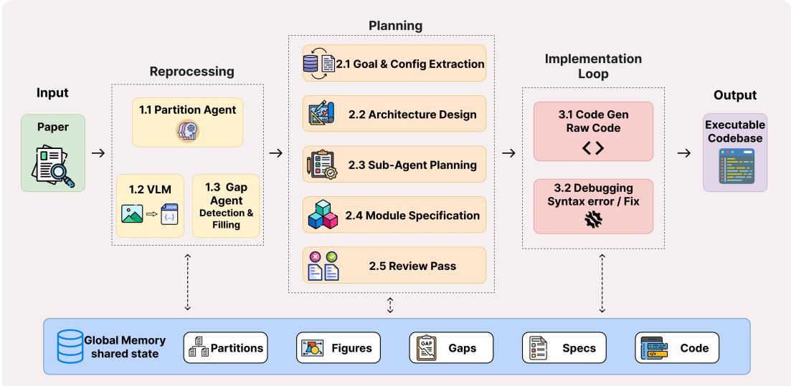
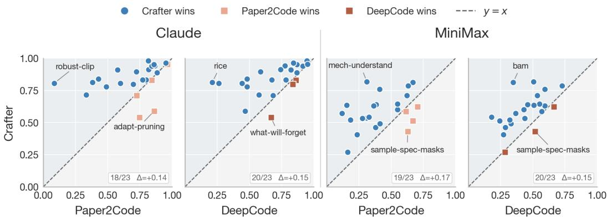
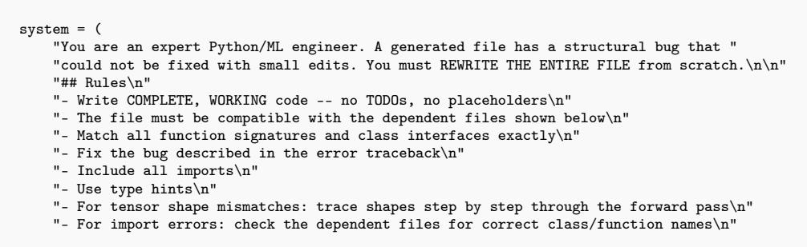

# Crafter: Towards Automated Reproducible Machine Learning via Agentic Code Generation

Anonymous Author(s)

Affiliation

Address

email

## Abstract

Reproducing machine learning research is challenging because many papers do not provide executable code, and key implementation details are often scattered, implicit, or missing. Existing paper-to-code systems improve over direct prompting, but the generated repositories can still miss paper-critical logic or fail at execution time. We propose Crafter, an automated paper-to-code pipeline that treats reproduction as a problem of context-calibrated implementation recovery rather than single-pass code generation. Crafter builds an evidence-grounded specification, resolves missing implementation details before planning, and repairs the generated repository through execution-aware debugging. We evaluate Crafter with PaperBench Code-Dev for implementation faithfulness and a self-designed execution-oriented benchmark for runtime readiness. Across 23 PaperBench papers using the Claude Sonnet 4.6 backend, Crafter achieves an average Code-Dev score of 0.84, improving over Paper2Code by 19.7% and over DeepCode by 22.1%. In execution evaluation, Crafter reaches the contribution-level milestone on all three repositories, compared with two for both baselines, while reducing average repair cycles from 11.0–11.3 to 5.0.

## 1 Introduction

Reproducibility is fundamental to machine learning (ML) research, as reproducible implementations enable the community to validate published claims, establish reliable baselines, explore alternative design choices, and build upon prior work. However, empirical evidence shows that a substantial portion of published ML studies are difficult or impossible to replicate due to a lack of transparency, unavailable code and data, inadequate reporting of experimental conditions, and methodological pitfalls such as data leakage [36, 41, 13]. The reproducibility challenge substantially undermines the trustworthiness of ML research and impedes innovation. Recent advances in LLM-enabled code generation (e.g., Codex [7] and Claude [2]) have demonstrated promising coding capabilities across programming languages such as Python, JavaScript, and SQL. Leading technology firms have adopted these tools in daily development [31, 9]. Inspired by LLM-enabled code generation, we ask the research question: Can we leverage LLMs to generate code that rigorouslyfollows the ML literature, reproduces results, designs and executes experiments, and assesses results without human intervention?

General-purpose code generation does not directly translate into reliable paper-to-code generation because 1) papers contain underspecified details, e.g., key hyperparameters; 2) Papers describe algorithms at a conceptual or mathematical level; 3) Research implementations often depend on ecosystem-specific behaviors (e.g, distributed training setups) that are not fully captured in the paper text; 4) Papers involve novel abstractions or theoretical constructs that require interpretation before implementation. On the other hand, recent systems such as Paper2Code [37] and DeepCode [24] propose more effective automated multi-stage pipelines for code generation from papers than direct

LLM-based generation. Despite the improved organization of the generated code, two significant gaps remain: the faithfulness to the published algorithms and the executability of the generated code. By examining the limitations observed in Paper2Code and DeepCode outputs, we identify two recurring error types that underlie these gaps. The first is fabrication-by-extrapolation, in which the model overextends partial evidence. The second isfabrication-by-omission, in which the model fills in missing implementation details with plausible but ungrounded defaults. These errors suggest that paper-to-code generation requires not only a structured pipeline, but also explicit control over what evidence each generation step receives.

We propose Crafter, an automated paper-to-code generation pipeline that bridges the gaps in faithfulness and executability through context-calibrated generation. Our key insight is that a faithful reproduction requires finer-grained evidence extraction and explicit recovery of missing implementation information. Instead of treating the paper as a flat document, Crafter organizes it into implementation-oriented evidence. It gathers information from text, figures, tables, and appendices, and identifies important details that are missing or unclear. These gaps are resolved before repository planning, so the code generator receives a more comprehensive implementation plan. The generated repository is then passed through an execution-aware debugging loop that fixes syntax and runtime errors. In this way, Crafter shifts the goal of generation from producing plausible source files to producing verifiable and executable repositories.

We evaluate Crafter with two metrics. First, following prior work, we use the Code-Dev mode of PaperBench [43] to measure code-development faithfulness: whether the generated repository satisfies fine-grained implementation requirements derived from real papers. Second, we build an execution-oriented evaluation benchmark using a three-paper subset of PaperBench to measure how closely the generated repositories resemble real code execution. This evaluation complements PaperBench Code-Dev by testing whether a codebase can move from implementation coverage to executable reproduction. Our results of PaperBench Code-Dev show that Crafter achieves 19.7% and 22.1% higher score than Paper2Code and DeepCode, respectively. For execution evaluation, Crafter reaches the contribution-level milestone for all three papers, compared with two for the two baseline systems.

## 66 2 Related Work

67 Code Generation with Large Language Models. Code generation has become increasingly 68 prominent with the rise of large language models trained on code [18, 15]. Recent developments 69 in this area can be broadly grouped into three main directions: model-level innovations, data-level 70 adaptations, and inference-time refinement strategies.Model-level innovations focus on changing 71 model architecture or the fundamental generation mechanism of LLMs to better understand and 72 generate code. For instance, StarCoder 2 [25] utilizes a Fill-in-the-Middle (FIM) objective, allowing 73 the model to leverage both preceding and succeeding code context to perform precise infilling tasks. 74 DeepSeek-Coder-V2 [58] introduces a Mixture-of-Experts (MoE) [39] architecture and a refined 75 tokenizer to improve efficiency and cross-language understanding while scaling to larger model sizes. 76 CRYSTAL[45] adopts a joint encoder–decoder design that enables unified handling of both natural 77 and programming languages, improving bidirectional reasoning between code and text. Meanwhile, 78 LLaDA [54] replaces the traditional autoregressive Transformer with a diffusion-based generation 79 process, modeling code generation as a denoising task rather than sequential token prediction. On the 80 other hand, data-level adaptations improve models after pre-training by fine-tuning on domain-specific 81 data or using preference optimization. Code Llama [33] and Qwen Coders [52, 17] are fine-tuned 82 on large programming datasets to improve reasoning and correctness, while Magicoder [48] builds 83 open-source instruction data to make generation more controllable and accurate. Finally, inference-84 time refinement strategies change how LLMs plan, generate, and verify code at runtime. Methods 85 such as AgentCoder [16] and OpenCodeInterpreter [56] use multi-agent collaboration and execution 86 feedback to iteratively test and correct code, while LDB [57] performs step-by-step debugging to 87 catch and fix runtime errors. These methods enhance reliability without retraining the model.

88 Paper-to-Code Generation. Paper-to-code reproduction is harder than general code generation 89 because papers omit implementation-critical details and depend on ecosystem-specific behaviour 90 rarely captured in the text. Paper2Code [37] and DeepCode [24] address this with multi-stage and multi-agent pipelines, but both absorb implementation gaps silently into generation and stop at source-level coverage rather than runtime readiness.

## 3 Methodology

In this section, we introduce the context calibration technique, the Crafter architecture, memory management, and the end-to-end pipeline that includes paper parsing, planning, code generation, and debugging.

## 3.1 Code Generation with Context Calibration

We formulate the paper-to-code problem as a challenge of contextual calibration. We identify two hallucination types in repository-level generation. The first is fabrication-by-extrapolation: the model extends partial evidence beyond what the paper supports. For example, if a paper mentions an adapter module, the model may invent an extra routing API or a new hyperparameter that is never specified. The second is fabrication-by-omission: the model fills an unspecified implementation choice with its own default. For example, if the paper does not report the learning rate, the model may silently choose one instead of marking it as an unresolved gap.

Crafter addresses these failures through a single principle: every agent invocation operates within a typed, bounded context. When the main risk is extrapolation, Crafter applies Contraction, restricting the context to the information needed for the current decision; When the main risk is omission, Crafter applies Expansion, adding evidence in a controlled way through a gap-analysis stage that resolves missing details against trusted sources.

Formally, Crafter implements contextual calibration as a spec-centered process. Given a research paper $P ,$ , the system first builds a structured implementation specification:

$$
S = f _ {\mathrm{spec}} (P)
$$

The specification $S$ serves as the implementation contract, containing the model architecture, loss functions, training procedures, hyperparameters, and other implementation-critical details. To reduce fabrication-by-omission during this stage, $f _ { \mathrm { s p e c } }$ applies the Expansion strategy: it identifies information gaps and resolves them against external registries and citation APIs when needed. This helps ground S in paper evidence and trusted external sources rather than LLM intuition.

The code generator then produces an initial codebase:

$$
C _ {0} = f _ {\mathrm{code}} (S)
$$

To reduce fabrication-by-extrapolation during generation, $f _ { \mathrm { c o d e } }$ applies the Contraction strategy: the context for each module is bounded to the specifications and dependencies defined in S, preventing the model from inventing symbols or interfaces outside the established contract.

A key design choice is that validation is also derived from the specification, rather than the generated code itself. We construct a set of executable checks:

$$
Q = \{q _ {i} \} _ {i = 1} ^ {m} = f _ {\mathrm{check}} (S)
$$

where each check $q _ { i }$ tests a specific component of the implementation contract, such as unit tests, static analysis, or artifact-level checks. Each check either passes or returns a diagnostic. At repair step t, we collect the set of failing diagnostics:

$$
D _ {t} = \{q _ {i} (C _ {t}): q _ {i} (C _ {t}) \text {fails} \}
$$

If $D _ { t }$ is empty, the codebase is accepted. Otherwise, the diagnostics are used by a repair agent $R$ to iteratively update the code:

$$
C _ {t + 1} = R (C _ {t}, D _ {t}, S)
$$

The final output is the first codebase $C ^ { * }$ that satisfies all spec-derived checks:

$$
q _ {i} (C ^ {*}) = \text {pass} \quad \forall i
$$

129 This formulation separates three distinct roles: the paper provides evidence; the specification defines 130 the implementation contract; and the checks convert that contract into executable validation. By 131 decoupling the contract from the implementation, we ensure that $C ^ { * }$ must pass all checks produced 132 independently of the code generation process, reducing the probability of producing plausible-looking 133 but non-functional code.

  
Figure 1: Crafter architecture. Ten types of agent across 3 stages pass information through a shared GlobalMemory. The partition agent decomposes the paper into structured partitions, which feed the VLM and gap analysis. Preprocessing outputs are passed to the planning agents, which produce the implementation plan used by the implementation loop.

## 3.2 System Architecture & Memory Model

Crafter is organized as a pipeline of multiple specialized agents, as shown in Figure 1 and detailed in Section 3.3. Unlike prior multi-agent systems that rely on unstructured dialogue [32, 50], Crafter enforces a fixed inter-agent dataflow mediated by a shared GlobalMemory. The GlobalMemory is a stage-indexed key-value store that serves as the single source of truth across the pipeline, allowing stages to remain decoupled and re-runnable in isolation. In addition, each agent maintains its own LocalMemory, which records its private trace of reasoning and intermediate attempts. This local trace is especially important for debugging: the Debug Agent consumes the code generator’s LocalMemory to recover the intended behavior behind a failed file, helping it distinguish between an incorrect implementation and an incorrect plan.

## 3.3 Pipeline Design

Structured Partitioning and VLM Analysis. The process begins by converting the raw PDF into a typed substrate. A deterministic Partition Agent segments the paper into body, appendix, references, and preamble. Simultaneously, a Vision-Language Agent performs figure-aware analysis. Rather than simply describing images, it classifies figures to exclude result plots and performs structured extraction of architecture diagrams into graph-based records (components, flows, stages). This phase converts lossy visual information into a typed format that downstream text-based planners can consume without re-viewing the image.

Gap Analysis with External Resolution. A dedicated Gap Agent identifies five categories of implementation-critical omissions: referenced\_architecture, baseline\_method, dataset\_detail, missing\_hyperparameter, and algorithm\_gap. The agent resolves these gaps through a three-tier cascade. It first checks a local registry for canonical ML datasets, such as CIFAR [22] and ImageNet [10]. It then performs in-paper lookup by cross-referencing appendices and footnotes. If the gap remains unresolved, the agent queries the Semantic Scholar [20] API using title matching, and fills the gap only when the retrieved source passes a string-similarity gate with OCR-ligature normalization. Gaps that remain unresolved are surfaced as explicit records, making missing implementation decisions visible rather than silently filled by the model.

Hierarchical Planning and Constraint Validation. Planning is split between a Main Planning Agent, which defines the global architecture, and a fan-out of Sub-Planning Agents, which produce module-level specifications. Before code is written, a constraint validator enforces orchestratormodule hygiene, reducing extrapolative planning errors by ensuring that entry points such as main.py coordinate the workflow without duplicating logic that belongs in implementation modules. A final cross-module review pass then checks for interface inconsistencies across parallel-generated subplans, such as mismatched return types, and injects reconciliation patches into the subsequent code-generation prompts.

Execution-Aware Code Generation & Debugging Code generation applies the contraction principle through asymmetric context. Module-generation prompts include only the source code of their declared dependencies, which prevents unrelated symbols from leaking across modules. In contrast, orchestrator-generation prompts include the full source code of all modules, allowing entry points and training scripts to wire the generated components correctly.

The Debug Agent closes the loop by running the codebase in a host subprocess. It utilizes a multigranularity fix tool (submit\_fix), which can choose between localized line edits, full-file rewrites, or triggering a dependency-cascade regeneration. If a file fails repeatedly, the system escalates from local repair to re-invoking the planner-conditioned generation for that module and all its importers.

## 4 Experiment Results

We evaluate Crafter-generated code repositories using two benchmarks. First, we use the Code-Dev mode of PaperBench [43] to measure code-development faithfulness, i.e., whether the generated repository satisfies the fine-grained requirements of a paper. Second, we measure execution readiness using an execution-oriented subset comprising three papers from PaperBench. These two evaluations separate the implementation coverage from the actual execution. The two evaluations are complementary in that the PaperBench Code-Dev measures implementation coverage, and the execution readiness quantifies practical running capability and repair cost.

## 4.1 Experiment Setup

We use PaperBench [43] as the benchmark throughout the research. PaperBench is a benchmark to evaluate AI systems for reproducing ML papers. It consists of 23 papers from ICML 2024. For each paper, PaperBench provides a hierarchical rubric tree, where the leaf nodes describe fine-grained requirements derived from the original paper. Scores are aggregated upward based on assigned weights, with the root score serving as the system’s final score for that paper. In our first evaluation, we focus on the Code Development leaves, which assess whether the generated repository implements the required models, algorithms, datasets, training procedures, baselines, and evaluation logic.

We compare Crafter with Paper2Code and DeepCode. All methods take the same input papers and are evaluated with the same PaperBench Code-Dev judge and scoring protocol. For the code-development evaluation, we run all three methods on the 23 papers in PaperBench. For the execution readiness evaluation, we use three papers from PaperBench.

We evaluate all methods in two backend settings. In the main setting, each method uses Claude Sonnet 4.6 [3] as its backend, and PaperBench Code-Dev scores are judged with OpenAI o4-mini[30]. In the supplementary setting, each method uses MiniMax M2.7[27] as its backend, and scores are judged with OpenAI gpt-4o-mini[29]. The supplementary setting tests whether the effectiveness of Crafter is specific to one backend model or remains consistent across different generators and judges. For execution-oriented evaluation and debugging, we use the Claude Sonnet 4.6 version and run all methods on a NVIDIA GH200 GPU under the same resource budget.

We report two groups of metrics. For Code-Dev, we report the average paper score, the median paper score, the leaf criteria passed, and the win count. Each paper score is the root score in its PaperBench rubric tree. The rubric is a weighted hierarchical tree: each Code-Dev leaf criterion is graded by the judge as 0 or 1, and internal nodes aggregate their child scores as weighted sums. Therefore, the final scores are in the range of [0, 1], where 1 indicates that all weighted Code-Dev requirements for that paper are satisfied. The average and median paper scores summarize paper-level implementation quality across the benchmark. The passed leaf criterion measures how many fine-grained rubric requirements are satisfied in papers. The win count measures the number of papers on which a method achieves the highest Code-Dev score among the candidates.

Table 1: PaperBench Code-Dev results on the full 23-paper benchmark. Claude denotes Claude Sonnet 4.6 with o4-mini judging, and MiniMax denotes MiniMax M2.7 with gpt-4o-mini judging. Avg. and Median are paper-level root scores in [0, 1]. Passed leaves count the total number of satisfied Code-Dev leaf criteria across all 23 papers. Wins counts the number of papers on which a method obtains the highest score within the same backend setting.

<table><tr><td>Backend</td><td>Method</td><td>Avg.</td><td>Median</td><td>Passed leaves</td><td>Wins</td></tr><tr><td>Claude</td><td>Paper2Code</td><td>0.6979</td><td>0.7712</td><td>2887/3942</td><td>4</td></tr><tr><td>Claude</td><td>DeepCode</td><td>0.6844</td><td>0.7410</td><td>2578/3942</td><td>2</td></tr><tr><td>Claude</td><td>Crafter</td><td>0.8354</td><td>0.8326</td><td>3034/3942</td><td>17</td></tr><tr><td>MiniMax</td><td>Paper2Code</td><td>0.4205</td><td>0.3837</td><td>1440/3942</td><td>4</td></tr><tr><td>MiniMax</td><td>DeepCode</td><td>0.4418</td><td>0.4406</td><td>1233/3942</td><td>1</td></tr><tr><td>MiniMax</td><td>Crafter</td><td>0.5875</td><td>0.5861</td><td>1757/3942</td><td>18</td></tr></table>

  
Figure 2: Per-paper Code-Dev: Crafter vs. each baseline. Each panel pairs one backend (Claude / MiniMax) with one baseline (Paper2Code / DeepCode). A point is one paper at coordinates (baseline, Crafter). Points above the $y = x$ diagonal (blue circles) are papers where Crafter outperforms the baseline; points below (orange / red squares) are papers where the baseline wins. The papers with the largest gain and the largest loss (by ∆ = Crafter − baseline) are annotated in each panel; corner boxes report wins / 23 and the mean ∆.

214 For execution-oriented evaluation, we report pre-repair execution milestone, human-repair cycles, 215 source-line edits and the count of repair tiers. These metrics measure how far a generated repository 216 is away from an executable reproduction workflow and how much human repair is required. We 217 define the execution milestones and the repair protocol in Section 4.3.

## 4.2 Results on PaperBench Code-Dev

Table 1 shows that Crafter consistently outperforms both baselines on the PaperBench Code-Dev. With Claude Sonnet 4.6 as backend, Crafter achieves the highest average and median paper scores, passes the most Code-Dev leaf criteria, and wins on 17 of the 23 papers. This indicates that the improvement is not only reflected in the aggregate score, but also in broad per-paper dominance across the benchmark.

The MiniMax setting confirms the same ranking under a different backend model and judge. Although all methods yield lower absolute scores with MiniMax, Crafter remains the top-performing method across all metrics. This suggests that the relative advantage of Crafter is independent of the chosen backend model.

The two baselines are comparatively close in aggregate performance. Paper2Code passes more leaf criteria in both settings and has more wins than DeepCode in the Claude setting, while DeepCode has a slightly higher average score in the MiniMax setting. In general, the baseline comparison shows that no single baseline dominates the other, while Crafter is consistently ahead of both.

Table 2: Execution protocols. M6 checks liveness: the repository emitted finite, in-range paperspecific metrics. M7 checks the qualitative contribution direction on the same fixture. LCA indicates the paper LCA-on-the-Line

<table><tr><td>Paper</td><td>Fixture</td><td>M6 liveness keys</td><td>M7 contribution invariant</td></tr><tr><td>LBCS</td><td>mnist_tiny</td><td>acc_lbcs, train_loss</td><td>acc_lbcs &gt; acc_uniform</td></tr><tr><td>SEMA</td><td>cifar_multitask</td><td>acc_sema, final_task_loss</td><td>acc_sema &gt; acc_baseline</td></tr><tr><td>LCA</td><td>gaussian_mixture</td><td>lca_method, id/ood_top1_error</td><td>lca_method &lt; lca_baseline</td></tr></table>

Per-Paper Analysis. The aggregate results show that Crafter improves the overall performance of Code-Dev. We further analyze the paper-level scores to understand whether this improvement is broad across the benchmark or concentrated in a small number of papers.

Figure 2 illustrates, for each paper, the Code-Dev score of Crafter against each baseline’s score under both backend settings. Points above the y = x line are papers where Crafter wins; points below show baseline wins. In both backend settings, Crafter improves over the baselines on most papers (18–20 out of 23), with mean ∆ between +0.14 and +0.17. The losses are on a small set of papers.

## 4.3 Execution-Oriented Evaluation

PaperBench Code-Dev measures whether a generated repository implements the required paper components in source code. However, source-level coverage does not guarantee that the repository can run as a reproduction artifact. We therefore ask a second question: can the repository launch, complete a small experiment, emit interpretable metrics, and recover the qualitative direction of the paper’s main claim? To answer this question, we build a method-neutral Probe–Plan–Run–Extract harness. We apply the harness to three PaperBench papers whose main empirical claims can be tested with small-scale experiments and compare the execution readiness among the three methods.

## 4.3.1 Evaluation Design

We evaluate three papers selected from PaperBench: LBCS[51], Self-Expansion[46] (abbreviated SEMA following the authors), and LCA-on-the-Line[40]. We choose papers whose main empirical claims can be tested with small fixture-scale experiments on a single GPU.A fixture refers to a lightweight, paper-specific test setup with reduced data, shortened training, and fixed metrics for checking the core claim. For each paper, we define a fixture-scale protocol with two checks: The M6 liveness check requires the repository to complete the fixture run and emit finite paper-specific metrics. The M7 contribution check requires these metrics to align with the qualitative direction of the major claims in the paper. Table 2 summarizes the protocols. The full paper-specific fixtures, metric keys, and contribution predicates are provided in Appendix D.

We use the same method-neutral Probe–Plan–Run–Extract harness for every paper-method combina tion. The harness first probes the repository to discover entry points, command-line flags, environment variables, and configuration files. Given this discovered interface, a fixed auxiliary planner chooses commands for a short smoke run and a longer pilot run. The planner is only allowed to use entry points and options that were found in the repository. The harness then runs the repository as a subprocess on the corresponding fixture. After the run finishes, the harness looks for newly created output files and extracts the metrics specified by the paper protocol. The final M6 and M7 predicates are evaluated by the harness, not by the repository or the planner.

We score the three methods using the milestone ladder in Table 3. Milestones M0–M5 measure how far the repository progresses before producing valid paper-specific metrics. M6 indicates that the repository emits valid metrics, and M7 indicates that those metrics satisfy the paper’s contributiondirection predicate. Repositories that do not reach M7 enter a bounded human-repair loop with a 20-cycle cap. We report the pre-repair milestone, the number of repair cycles required to reach M7, source-line edits, and the count of repair tiers. Repair tiers are grouped into S1, S2, and S3, ranging from mechanical surface fixes to localized logic/configuration fixes and architectural or claim-level repairs. Detailed harness rules, error categories, and repair-tier definitions are provided in Appendix D.

Table 3: Execution milestone ladder. Higher milestones indicate deeper progress toward an executable, claim-bearing reproduction.

<table><tr><td>Milestone</td><td>Criterion</td></tr><tr><td>M0</td><td>No entry point discovered.</td></tr><tr><td>M1</td><td>Entrypoint found, but did not launch or failed immediately.</td></tr><tr><td>M2</td><td>Launched, but smoke run did not complete within timeout.</td></tr><tr><td>M3</td><td>Smoke run completed, but produced no nonempty artifact.</td></tr><tr><td>M4</td><td>Smoke artifacts exist, but pilot run did not complete.</td></tr><tr><td>M5</td><td>Pilot run completed, but liveness predicate failed.</td></tr><tr><td>M6</td><td>Liveness predicate passed, but contribution predicate failed.</td></tr><tr><td>M7</td><td>Contribution predicate passed.</td></tr></table>

Table 4: Pre-repair execution outcomes for the first invocation of each generated repository. Each cell reports the milestone reached before any operator repair, with the automatically classified first failure category shown in parentheses. No operator patches are applied in this stage.

<table><tr><td>Method</td><td>LBCS</td><td>SEMA</td><td>LCA-on-the-Line</td></tr><tr><td>Paper2Code</td><td>M1 (CLI mismatch)</td><td>M5 (CLI mismatch)</td><td>M5 (no metrics)</td></tr><tr><td>DeepCode</td><td>M1 (CLI mismatch)</td><td>M1 (missing import)</td><td>M1 (CLI mismatch)</td></tr><tr><td>Crafter</td><td>M5 (syntax error)</td><td>M5 (no metrics)</td><td>M5 (undefined symbol)</td></tr></table>

## 4.3.2 Results.

Execution readiness before repair. Table 4 reports how far each generated repository progresses before any human repair. Without operator intervention, no generated repository reaches the contribution-invariant level (M7). Crafter reaches M5 on all three papers, meaning that each repository launches, completes the pilot run, and produces outputs for the paper-specific liveness check. Paper2Code reaches M5 on two papers, but fails at launch on LBCS. DeepCode fails at or immediately after launch on all three papers. This shows that Crafter is consistently closer to an executable workflow before repair.

Repair distance to M7. Table 5 reports how much human repair is needed to bring each generated repository to M7. Crafter reaches M7 on all three papers with fewer repair cycles and fewer sourceline edits than either baseline. More importantly, it requires no S3 architectural-tier patches, indicating that the remaining failures are local rather than structural. The baselines require substantially heavier repair. Paper2Code and DeepCode each reach M7 on two of the three papers, but both require S3 intervention. In practice, these repairs address missing paper-level execution logic, such as absent evaluation tails, unimplemented experimental phases, or emitted metrics that do not correspond to the protocol-defined quantities. These results suggest that Crafter starts closer to the paper-specific contribution checks, whereas the baselines often require architectural repair before the same checks can be evaluated.

The S3 repairs usually reflect missing claim-level execution paths. Baseline repositories often contain paper-named components, but they do not always connect them to the experiments required to test the paper’s major claim. For instance, LBCS baselines miss the comparison between the train-on-coreset and the uniform-baseline, and LCA-on-the-Line baselines miss the synthetic phase used by our executable invariant. We also observe metric mismatches, where a paper-cited function name is present, but the emitted scalar does not match the protocol-defined quantity. These failures are difficult to detect with source-level judging alone, but they dominate the effort needed for executable reproduction.

## 4.4 Ablation Study

We ablate Crafter on a five-paper subset to isolate the effectiveness of gap filling and debugging. We compare the full Crafter pipeline against two variants: one that keeps gap filling but disables the debug loop, and one that disables both gap filling and debugging. Table 6 reports the per-paper ablation results. The full system achieves the best score on all five papers, with an average score of 0.941. Removing the debug loop reduces the average to 0.871, while removing both gap filling and debugging reduces it to 0.854. The ablation result clearly validate the effectiveness of the gap filling and debugging techniques in Crafter.

Table 5: Aggregate repair distance to M7. “Reached M7” counts the contribution invariant held after repair. “Avg cycles” is the mean number of repair cycles run per cell (cap 20). “|∆LOC|” aggregates additions + deletions across all three cells. S1/S2/S3 sum the per-cell distinct patches at each repair tier; “S3 cells” counts cells that required at least one architectural-tier patch.

<table><tr><td>Method</td><td>Reached M7</td><td>Avg cycles</td><td> $|\Delta LOC|$ </td><td>S1</td><td>S2</td><td>S3</td><td>S3 cells</td></tr><tr><td>Paper2Code</td><td>2/3</td><td>11.0</td><td>322</td><td>9</td><td>2</td><td>3</td><td>3/3</td></tr><tr><td>DeepCode</td><td>2/3</td><td>11.3</td><td>421</td><td>12</td><td>6</td><td>3</td><td>3/3</td></tr><tr><td>Crafter</td><td>3/3</td><td>5.0</td><td>232</td><td>2</td><td>2</td><td>0</td><td>0/3</td></tr></table>

Table 6: Per-paper ablation scores on the five-paper subset.

<table><tr><td>Paper</td><td>Crafter</td><td>w/o debug</td><td>w/o gaps/debug</td><td>DeepCode</td><td>Paper2Code</td></tr><tr><td>BaM[5]</td><td>0.980</td><td>0.947</td><td>0.976</td><td>0.946</td><td>0.814</td></tr><tr><td>PINN[6]</td><td>0.951</td><td>0.890</td><td>0.856</td><td>0.869</td><td>0.859</td></tr><tr><td>All-in-One[12]</td><td>0.940</td><td>0.866</td><td>0.851</td><td>0.776</td><td>0.867</td></tr><tr><td>Mech. Understanding[23]</td><td>0.940</td><td>0.921</td><td>0.896</td><td>0.916</td><td>0.843</td></tr><tr><td>BBOX[44]</td><td>0.894</td><td>0.731</td><td>0.693</td><td>0.585</td><td>0.722</td></tr><tr><td>Average</td><td>0.941</td><td>0.871</td><td>0.854</td><td>0.818</td><td>0.821</td></tr></table>

## 5 Conclusions

We presented Crafter, a paper-to-code system motivated by the gap between plausible code generation and faithful, executable reproduction. This gap reflects two challenges: papers often omit important implementation choices, and generated repositories may appear complete at the source level while still failing to run or support the paper’s main claims. Crafter makes progress on these challenges by organizing paper evidence into a controlled generation process and by connecting code generation with execution-oriented validation. Across PaperBench Code-Dev and our execution-readiness evaluation, Crafter improves over prior paper-to-code pipelines in implementation faithfulness and requires less repair to satisfy executable contribution checks. Overall, our results suggest that future paper-to-code systems should be designed and assessed on both implementation faithfulness and execution readiness, rather than source-level plausibility alone.

## 6 Future Works

Although Crafter reduces the repair cycles from 11.0-11.3 to 5.0 in the execution evaluation, there still requires human effort for bug fixing. Further, the scope of Crafter is limited to qualitative evaluation rather than quantitative reproduction. E.g., if a paper claims a 5.5% improvement over baseline, Crafter only confirms the improvement trend, not the exact 5.5% improvement. Another important aspect of reproducible ML research is runtime environment configuration, where the software dependencies is part of the code repository. We will continue work on these three directions with the goal of automated reproducible ML research.

## References

[1] M. S. Albergo, M. Goldstein, N. M. Boffi, R. Ranganath, and E. Vanden-Eijnden. Stochastic interpolants with data-dependent couplings. arXiv preprint arXiv:2310.03725, 2023.

[2] Anthropic. The claude 3 model family: Opus, sonnet, haiku. URL https://api. semanticscholar.org/CorpusID:268232499.

[3] Anthropic. System card: Claude 4.6 sonnet, 2025. URL https://www-cdn.anthropic. com/78073f739564e986ff3e28522761a7a0b4484f84.pdf.

[4] C. Cai, Z. Ye, L. Feng, J. Qi, and F. Liu. Sample-specific masks for visual reprogramming-based prompting. arXiv preprint arXiv:2406.03150, 2024.

[5] D. Cai, C. Modi, L. Pillaud-Vivien, C. C. Margossian, R. M. Gower, D. M. Blei, and L. K. Saul. Batch and match: black-box variational inference with a score-based divergence. arXiv preprint arXiv:2402.14758, 2024.

[6] D. Cai, C. Modi, L. Pillaud-Vivien, C. C. Margossian, R. M. Gower, D. M. Blei, and L. K. Saul. Batch and match: black-box variational inference with a score-based divergence. arXiv preprint arXiv:2402.14758, 2024.

[7] M. Chen, J. Tworek, H. Jun, Q. Yuan, H. P. de Oliveira Pinto, J. Kaplan, H. Edwards, Y. Burda, N. Joseph, G. Brockman, A. Ray, R. Puri, G. Krueger, M. Petrov, H. Khlaaf, G. Sastry, P. Mishkin, B. Chan, S. Gray, N. Ryder, M. Pavlov, A. Power, L. Kaiser, M. Bavarian, C. Winter, P. Tillet, F. P. Such, D. Cummings, M. Plappert, F. Chantzis, E. Barnes, A. Herbert-Voss, W. H. Guss, A. Nichol, A. Paino, N. Tezak, J. Tang, I. Babuschkin, S. Balaji, S. Jain, W. Saunders, C. Hesse, A. N. Carr, J. Leike, J. Achiam, V. Misra, E. Morikawa, A. Radford, M. Knight, M. Brundage, M. Murati, K. Mayer, P. Welinder, B. McGrew, D. Amodei, S. McCandlish, I. Sutskever, and W. Zaremba. Evaluating large language models trained on code. arXiv preprint arXiv:2107.03374, 2021.

[8] Z. Cheng, X. Wu, J. Yu, S. Yang, G. Wang, and X. Xing. Rice: Breaking through the training bottlenecks of reinforcement learning with explanation. arXiv preprint arXiv:2405.03064, 2024.

[9] K. Z. Cui, M. Demirer, S. Jaffe, L. Musolff, S. Peng, and T. Salz. The effects of generative ai on high-skilled work: Evidence from three field experiments with software developers. Management Science, 2026.

[10] J. Deng, W. Dong, R. Socher, L.-J. Li, K. Li, and L. Fei-Fei. Imagenet: A large-scale hierarchical image database. In 2009 IEEE conference on computer vision and pattern recognition, pages 248–255. Ieee, 2009.

[11] K. Frans, S. Park, P. Abbeel, and S. Levine. Unsupervised zero-shot reinforcement learning via functional reward encodings. arXiv preprint arXiv:2402.17135, 2024.

[12] M. Gloeckler, M. Deistler, C. Weilbach, F. Wood, and J. H. Macke. All-in-one simulation-based inference. arXiv preprint arXiv:2404.09636, 2024.

[13] O. E. Gundersen, O. Cappelen, M. Mølnå, and N. G. Nilsen. The unreasonable effectiveness of open science in ai: A replication study. In Proceedings of the AAAI Conference on Artificial Intelligence, volume 39, pages 26211–26219, 2025.

[14] S. Hong, M. Zhuge, J. Chen, X. Zheng, Y. Cheng, J. Wang, C. Zhang, Z. Wang, S. K. S. Yau, Z. Lin, et al. Metagpt: Meta programming for a multi-agent collaborative framework. In The twelfth international conference on learning representations, 2023.

[15] X. Hou, Y. Zhao, Y. Liu, Z. Yang, K. Wang, L. Li, X. Luo, D. Lo, J. Grundy, and H. Wang. Large language models for software engineering: A systematic literature review. ACM Transactions on Software Engineering and Methodology, 33(8):1–79, 2024.

[16] D. Huang, J. M. Zhang, M. Luck, Q. Bu, Y. Qing, and H. Cui. Agentcoder: Multi-agent-based code generation with iterative testing and optimisation, 2024. URL https://arxiv.org/ abs/2312.13010.

[17] B. Hui, J. Yang, Z. Cui, J. Yang, D. Liu, L. Zhang, T. Liu, J. Zhang, B. Yu, K. Lu, et al. Qwen2. 5-coder technical report. arXiv preprint arXiv:2409.12186, 2024.

[18] J. Jiang, F. Wang, J. Shen, S. Kim, and S. Kim. A survey on large language models for code generation. ACM Transactions on Software Engineering and Methodology, 35(2):1–72, 2026.

[19] X. Jin and X. Ren. What will my model forget? forecasting forgotten examples in language model refinement. arXiv preprint arXiv:2402.01865, 2024.

[20] R. Kinney, C. Anastasiades, R. Authur, I. Beltagy, J. Bragg, A. Buraczynski, I. Cachola, S. Candra, Y. Chandrasekhar, A. Cohan, et al. The semantic scholar open data platform. arXiv preprint arXiv:2301.10140, 2023.

[21] T. Knappe, R. Li, A. Chauhan, K. Chhua, K. Zhu, and S. O’Brien. Semantic self-consistency: Enhancing language model reasoning via semantic weighting. arXiv preprint arXiv:2410.07839, 2024.

[22] A. Krizhevsky. Learning multiple layers of features from tiny images. Technical report, University of Toronto, 2009.

[23] A. Lee, X. Bai, I. Pres, M. Wattenberg, J. K. Kummerfeld, and R. Mihalcea. A mechanistic understanding of alignment algorithms: A case study on dpo and toxicity. arXiv preprint arXiv:2401.01967, 2024.

[24] Z. Li, Z. Li, Z. Guo, X. Ren, and C. Huang. Deepcode: Open agentic coding, 2025. URL https://arxiv.org/abs/2512.07921.

[25] A. Lozhkov, R. Li, L. B. Allal, F. Cassano, J. Lamy-Poirier, N. Tazi, A. Tang, D. Pykhtar, J. Liu, Y. Wei, T. Liu, M. Tian, D. Kocetkov, A. Zucker, Y. Belkada, Z. Wang, Q. Liu, D. Abulkhanov, I. Paul, Z. Li, W.-D. Li, M. Risdal, J. Li, J. Zhu, T. Y. Zhuo, E. Zheltonozhskii, N. O. O. Dade, W. Yu, L. Krauß, N. Jain, Y. Su, X. He, M. Dey, E. Abati, Y. Chai, N. Muennighoff, X. Tang, M. Oblokulov, C. Akiki, M. Marone, C. Mou, M. Mishra, A. Gu, B. Hui, T. Dao, A. Zebaze, O. Dehaene, N. Patry, C. Xu, J. McAuley, H. Hu, T. Scholak, S. Paquet, J. Robinson, C. J. Anderson, N. Chapados, M. Patwary, N. Tajbakhsh, Y. Jernite, C. M. Ferrandis, L. Zhang, S. Hughes, T. Wolf, A. Guha, L. von Werra, and H. de Vries. Starcoder 2 and the stack v2: The next generation. arXiv preprint arXiv:2402.19173, 2024.

403 [26] M. Malagon, J. Ceberio, and J. A. Lozano. Self-composing policies for scalable continual 404 reinforcement learning. arXiv preprint arXiv:2506.14811, 2025.

405 [27] MiniMax. MiniMax-M2.7: Built for Agents, coding and beyond, 2025. URL https://www. 406 minimax.io/news/minimax-m27-en.

407 [28] S. Niu, C. Miao, G. Chen, P. Wu, and P. Zhao. Test-time model adaptation with only forward 408 passes. arXiv preprint arXiv:2404.01650, 2024.

409 [29] OpenAI. Gpt-4o mini: Advancing cost-efficient intelligence. https://openai.com/index/ 410 gpt-4o-mini-advancing-cost-efficient-intelligence/, 2024.

411 [30] OpenAI. OpenAI o3 and o4-mini system card, 2025. URL https://cdn.openai.com/pdf/ 412 2221c875-02dc-4789-800b-e7758f3722c1/o3-and-o4-mini-system-card.pdf.

[31] S. Peng, E. Kalliamvakou, P. Cihon, and M. Demirer. The impact of ai on developer productivity: Evidence from github copilot. arXiv preprint arXiv:2302.06590, 2023.

[32] C. Qian, W. Liu, H. Liu, N. Chen, Y. Dang, J. Li, C. Yang, W. Chen, Y. Su, X. Cong, et al. Chatdev: Communicative agents for software development. In Proceedings of the 62nd annual meeting of the association for computational linguistics (volume 1: Long papers), pages 15174–15186, 2024.

[33] B. Rozière, J. Gehring, F. Gloeckle, S. Sootla, I. Gat, X. E. Tan, Y. Adi, J. Liu, R. Sauvestre, T. Remez, J. Rapin, A. Kozhevnikov, I. Evtimov, J. Bitton, M. Bhatt, C. C. Ferrer, A. Grattafiori, W. Xiong, A. Défossez, J. Copet, F. Azhar, H. Touvron, L. Martin, N. Usunier, T. Scialom, and G. Synnaeve. Code llama: Open foundation models for code. arXiv preprint arXiv:2308.12950, 2023.

[34] G. Sanchez, H. Fan, A. Spangher, E. Levi, P. S. Ammanamanchi, and S. Biderman. Stay on topic with classifier-free guidance. arXiv preprint arXiv:2306.17806, 2023.

[35] C. Schlarmann, N. D. Singh, F. Croce, and M. Hein. Robust clip: Unsupervised adversarial fine-tuning of vision embeddings for robust large vision-language models. arXiv preprint arXiv:2402.12336, 2024.

[36] H. Semmelrock, T. Ross-Hellauer, S. Kopeinik, D. Theiler, A. Haberl, S. Thalmann, and D. Kowald. Reproducibility in machine-learning-based research: Overview, barriers, and drivers. AI Magazine, 46(2):e70002, 2025.

[37] M. Seo, J. Baek, S. Lee, and S. J. Hwang. Paper2code: Automating code generation from scientific papers in machine learning. In The Fourteenth International Conference on Learning Representations, 2026. URL https://openreview.net/forum?id=3DcaUTjdKc.

[38] L. Sharrock, J. Simons, S. Liu, and M. Beaumont. Sequential neural score estimation: Likelihood-free inference with conditional score based diffusion models. arXiv preprint arXiv:2210.04872, 2022.

[39] N. Shazeer, A. Mirhoseini, A. Maziarz, A. Davis, Q. Le, G. Hinton, and J. Dean. Outrageously large neural networks: The sparsely-gated mixture-of-experts layer. In International Conference on Learning Representations, 2017.

[40] J. Shi, G. Gare, J. Tian, S. Chai, Z. Lin, A. Vasudevan, D. Feng, F. Ferroni, and S. Kong. Lca-on-the-line: Benchmarking out-of-distribution generalization with class taxonomies. arXiv preprint arXiv:2407.16067, 2024.

[41] M. L. Siddiq, A. Islam-Gomes, N. Sekerak, and J. Santos. Large language models for software engineering: A reproducibility crisis. arXiv preprint arXiv:2512.00651, 2025.

[42] J. Singla, A. Agarwal, and D. Pathak. Sapg: Split and aggregate policy gradients. arXiv preprint arXiv:2407.20230, 2024.

[43] G. Starace, O. Jaffe, D. Sherburn, J. Aung, J. S. Chan, L. Maksin, R. Dias, E. Mays, B. Kinsella, W. Thompson, J. Heidecke, A. Glaese, and T. Patwardhan. Paperbench: Evaluating ai’s ability to replicate ai research, 2025. URL https://arxiv.org/abs/2504.01848.

[44] H. Sun, Y. Zhuang, W. Wei, C. Zhang, and B. Dai. Bbox-adapter: Lightweight adapting for black-box large language models. arXiv preprint arXiv:2402.08219, 2024.

[45] T. Tao, J. Li, B. Tan, H. Wang, W. Marshall, B. M. Kanakiya, J. Hestness, N. Vassilieva, Z. Shen, E. P. Xing, and Z. Liu. Crystal: Illuminating llm abilities on language and code, 2024. URL https://arxiv.org/abs/2411.04156.

[46] H. Wang, H. Lu, L. Yao, and D. Gong. Self-expansion of pre-trained models with mixture of adapters for continual learning. In Proceedings of the Computer Vision and Pattern Recognition Conference, pages 10087–10098, 2025.

[47] X. Wang, B. Lin, D. Liu, Y.-C. Chen, and C. Xu. Bridging data gaps in diffusion models with adversarial noise-based transfer learning. In Forty-first International Conference on Machine Learning, 2024.

[48] Y. Wei, Z. Wang, J. Liu, Y. Ding, and L. Zhang. Magicoder: Empowering code generation with oss-instruct. arXiv preprint arXiv:2312.02120, 2024.

[49] M. Wołczyk, B. Cupiał, M. Ostaszewski, M. Bortkiewicz, M. Zaj ˛ac, R. Pascanu, Ł. Kucinski,´ and P. Miłos. Fine-tuning reinforcement learning models is secretly a forgetting mitigation´ problem. arXiv preprint arXiv:2402.02868, 2024.

[50] Q. Wu, G. Bansal, J. Zhang, Y. Wu, B. Li, E. Zhu, L. Jiang, X. Zhang, S. Zhang, J. Liu, et al. Autogen: Enabling next-gen llm applications via multi-agent conversations. In First conference on language modeling, 2024.

[51] X. Xia, J. Liu, S. Zhang, Q. Wu, H. Wei, and T. Liu. Refined coreset selection: Towards minimal coreset size under model performance constraints. arXiv preprint arXiv:2311.08675, 2023.

[52] A. Yang, A. Li, B. Yang, B. Zhang, B. Hui, B. Zheng, B. Yu, C. Gao, C. Huang, C. Lv, et al. Qwen3 technical report. arXiv preprint arXiv:2505.09388, 2025.

[53] J. Yang, C. E. Jimenez, A. Wettig, K. Lieret, S. Yao, K. Narasimhan, and O. Press. Sweagent: Agent-computer interfaces enable automated software engineering. Advances in Neural Information Processing Systems, 37:50528–50652, 2024.

[54] Z. You, S. Nie, X. Zhang, J. Hu, J. Zhou, Z. Lu, J.-R. Wen, and C. Li. Llada-v: Large language diffusion models with visual instruction tuning, 2025. URL https://arxiv.org/abs/2505. 16933.

[55] B. Zhao, H. Hajishirzi, and Q. Cao. Apt: Adaptive pruning and tuning pretrained language models for efficient training and inference. arXiv preprint arXiv:2401.12200, 2024.

[56] T. Zheng, G. Zhang, T. Shen, X. Liu, B. Y. Lin, J. Fu, W. Chen, and X. Yue. Opencodeinterpreter: Integrating code generation with execution and refinement, 2025. URL https://arxiv.org/ abs/2402.14658.

[57] L. Zhong, Z. Wang, and J. Shang. Debug like a human: A large language model debugger via verifying runtime execution step-by-step, 2024. URL https://arxiv.org/abs/2402. 16906.

[58] Q. Zhu, D. Guo, Z. Shao, D. Yang, P. Wang, R. Xu, Y. Wu, Y. Li, H. Gao, S. Ma, et al. Deepseek-coder-v2: Breaking the barrier of closed-source models in code intelligence. arXiv preprint arXiv:2406.11931, 2024.

## A Prompts

The full system prompts used at every LLM-driven stage of the pipeline are reproduced verbatim from the released source as listing boxes within the relevant methodology subsections of Appendix B. The vision–language stage is covered by Box 2 (classification) and Box B.3.2 (structured extraction); the gap stage by Box 3; planning by Boxes B.3.4–B.3.4 (goal/config extraction, paper analysis, architecture design, architecture replan, sub-planning, and cross-module review); code generation by Box 5 (module files) and Box B.3.5 (orchestrator files); unit-test generation by Box 6; and debugging by Box 7 (tool-using debug loop) and Box B.3.7 (structural rewrite).

## B Extended Methodology and Implementation Details

This section provides the full technical description of the Crafter pipeline as detailed in the source methodology documents.

## B.1 System Overview

Methodological principle. Crafter is structured around a single discipline applied stage by stage: every LLM call in the pipeline sees a typed, bounded context, and the boundary is chosen against the failure mode each call is most prone to. Where the dominant failure mode is fabrication-byextrapolation—the model inventing a symbol, a class, a hyperparameter, or an import that does not exist—the context is contracted: the sub-planner sees only the gaps tagged relevant to its module (§3.3.4), the code-generation prompt sees only the source of files declared as dependencies (§3.3.5), the unit-test prompt sees only an AST-extracted whitelist of importable symbols (§3.3.6), and the debug agent sees the codebase only through bounded read\_file / search\_codebase tool calls rather than as a wholesale dump (§3.3.7). Where the dominant failure mode is the opposite—fabrication-by-omission, in which the LLM produces a plausible value the paper does not state—the context is instead expanded with externally retrieved or cross-stage information whose provenance is preserved: the gap-analysis stage surfaces and resolves missing paper-level information against a tiered cascade of trusted sources (§3.3.3), and the planner’s review pass injects crossmodule interface findings into every code-generation prompt downstream (§3.3.4). Each of the four contributions below is an instance of one of these two moves, and §3.4 makes the principle’s reach across the pipeline explicit.

Crafter Agent converts a parsed research paper—its sectioned content list and extracted figures—into a runnable PyTorch codebase together with unit tests. The system is organised as a sequence of eight agent types; sub-planning is a single type instantiated once per code module, so the runtime instance count is 8 + N for an architecture with N modules. A partition agent splits the paper into typed sections (body, appendix, references, preamble) by deterministic parsing of the content list; a vision– language agent classifies and structurally extracts architecture- and pipeline-style figures; a gap agent identifies information missing from the paper and resolves it through a tiered cascade across three levels of trust—a local dataset registry, an in-paper appendix lookup, and a title-matched Semantic Scholar [20] retrieval—with anything that fails all three retained as an explicit unresolved\_gap record. A main planning agent decomposes the implementation into a file-level architecture and three independent plans (experiments, baselines, dataset loading); a fan-out of sub-planning agents produces a per-module specification in parallel; a code-generation agent emits each file in dependency order with two passes (modules first, then orchestrator) and a syntax self-correction step; a unit-test agent generates tests against an AST-extracted closed symbol table; and a debug agent iteratively runs the codebase as a host subprocess and patches errors through three native-tool-call primitives (read\_file, search\_codebase, submit\_fix).

Stages execute sequentially, but planning exploits asyncio.gather at three levels—a parallel extraction phase that issues goal-and-config and paper-analysis calls concurrently, three independent plan ning subtasks (experiments, baselines, dataset loading), and N module sub-planners—to amortise latency across the most expensive part of the pipeline. Inter-agent state lives in a shared GlobalMemory keyed by stage and persisted as one file per key with thread-safe asyncio→background-thread writes. In parallel, every agent maintains a per-agent LocalMemory trace (conversation history, reasoning, intermediate attempts), read by the unit-test and debug agents to recover why a particular file was written a particular way (§3.3.6, §3.3.7) and otherwise persisted as an artefact for post-hoc analysis of agent behaviour.

Relation to prior agentic coding systems. Crafter sits in a small but growing literature on multistage and multi-agent code generation. Its closest precedent is PaperCoder [37], which decomposes paper-to-code into a planning–analysis–coding chain. Crafter inherits the staged decomposition and diverges in three substantive ways: (i) a dedicated pre-planning gap-analysis stage surfaces paper-level information gaps and resolves them where possible against external sources, rather than absorbing them silently into planning; (ii) planning is hierarchical and parallel—three independent planning subtasks fan out into N module sub-planners followed by a cross-module review pass—rather than a single flat planning chain; and (iii) the pipeline includes explicit debug and unit-test stages that target the gap from “code generated” to “code executes”, which PaperCoder treats as out of scope. Crafter’s typed sequential pipeline also contrasts with the dialogue-driven role-play of ChatDev [32] and AutoGen [50] and with MetaGPT’s SOP-driven waterfall [14]: the methodological commitment in Crafter is fixed inter-agent dataflow through a shared GlobalMemory (§3.5), which is what makes individual stages re-runnable in isolation. The debug agent’s tool design is closest to SWE-agent [53] and Aider; Crafter’s submit\_fix differs in exposing three concurrent granularities of fix in a single tool call and in the planner-conditioned dependency-cascade regeneration triggered after repeated same-file failure (§3.3.7), which lets the agent escalate from local repair to planner-conditioned regeneration without leaving the loop.

The contributions of this work are:

• Gap analysis with title-matched external resolution. A dedicated pre-planning stage extracts five categories of information gap (referenced architectures, baseline methods, dataset details, missing hyperparameters, algorithm gaps) and resolves them through a tiered cascade that prefers in-system sources (a curated dataset registry; in-paper appendix lookups) before falling back to a Semantic Scholar query gated by a conjunctive title-similarity check with OCR-ligature normalisation. Gaps that fail every tier are surfaced to downstream agents as explicit unresolved\_gap records rather than silently filled, so that fabrication is at minimum visible in the pipeline state.

• Hierarchical planning with cross-module review. Three independent planning subtasks run against a shared architecture, then N module sub-planners run in parallel against gapfiltered context, then a final review pass over the resulting per-module specifications whose output is re-injected into every code-generation prompt downstream. The review pass is intended to surface inter-module interface inconsistencies before code generation begins.

• Tool-using debug agent with multi-granularity fix primitives. The debug agent is exposed three native tool calls—read\_file, search\_codebase, and submit\_fix—of which only submit\_fix is side-effecting. submit\_fix accepts three concurrent fix modes—localised line-range edits, full-file rewrites, and files\_to\_create that spawn fresh code-generation agents—corresponding to three granularities of repair: edits for localised symptoms, rewrites for whole-file structural problems, and code-generation re-invocation for files the planner missed entirely.

• Closed-symbol-table unit-test generation. Test prompts embed an AST-extracted whitelist of every importable top-level symbol from previously generated files, and the test agent is constrained to import only from this whitelist. The whitelist is intended to prevent the failure mode in which LLM-generated tests import symbols the model invented or misnamed.

## B.2 Pipeline Orchestration

The pipeline is a hand-rolled asyncio program rather than a workflow-engine graph. The toplevel run\_pipeline coroutine awaits each stage in sequence—partition, VLM figure analysis, gap analysis, planning, code generation, debug, and (optionally) unit-test generation—and reports perstage token counts and accumulated cost between stages. Stage skipping (–no-vlm, –skip-debug, –skip-gaps, –only-debug, –unit-test) is handled at this level by guarding the corresponding await. Within stages, parallelism comes from asyncio.gather: the planning stage runs three sequential fan-outs—an extraction phase that issues goal-and-config and paper-analysis calls concurrently, three independent planning subtasks (experiments, baselines, dataset loading), and one sub-planning agent per code module. No stage runs concurrently with another—the pipeline’s graph is a chain of supersteps, each potentially containing one or more fan-outs.

Agents do not call each other directly. All inter-agent communication flows through a single shared GlobalMemory object, instantiated once in run\_pipeline and threaded into every agent at construction. Each agent reads its inputs from named keys (partitions, figure\_analysis, architecture, module\_specs, generated\_code, supplementary\_context, . . . ) and writes its outputs back to the same store. The store is keyed on disk as one file per key—JSON for structured values, Markdown for free-text values—and is safe across the asyncio thread and the background writer threads it spawns: each set serialises its value to a string in the calling task before handing the immutable string to a daemon writer thread that holds a per-store lock. In parallel, every agent maintains a private LocalMemory recording its conversation history, reasoning steps, and intermediate attempts. LocalMemory uses the same async-safe write pattern as GlobalMemory, and is read back in two places: by the unit-test agent, which loads the codegen LocalMemory of each file to recover the spec it was written against, and by the debug agent, which can reconstruct the rationale for a particular generated file when diagnosing a failure.

All LLM traffic is mediated by a single client module that exposes three call surfaces—text completion, tool-using completion, and vision—over five interchangeable backends (an Anthropic-compatible MiniMax endpoint, Anthropic Claude, OpenAI, DeepSeek, and Gemini), selected by a process-global set\_backend call. The client handles two failure modes invisibly to its callers. Output continuation: if the model stops with max\_tokens, the client appends the partial response to the message list and re-issues the request, up to a fixed cap of continuations; if the cap is reached without a stop reason of end\_turn, the partial output is returned to the caller, who decides whether to accept it or fail the stage. Input truncation: if the request exceeds context, the client repeatedly shrinks the longest user message and retries; the loop terminates either when the call succeeds or when the message reaches a minimum length below which further shrinking would discard required content, at which point the failure is propagated to the caller. Vision calls additionally use exponential backoff on transient connection, timeout, rate-limit, or 5xx errors. A global TokenUsage accumulator splits costs by stage and separates VLM tokens from main-model tokens, so per-stage cost can be reported alongside per-stage latency; the per-stage breakdown across backbones is given in §4.

## B.3 Stages

## B.3.1 Partition

Partition establishes the typed substrate on which the rest of the principle operates: every later contraction or expansion is keyed by section role, item kind, or figure index, and those types originate here. The partition agent is the only stage with no LLM call. It consumes a MinerU-produced \*\_content\_list\_v2.json, in which the paper has already been OCR’d and segmented into a list of pages, each a list of typed items (title, paragraph, equation\_interline, algorithm, table, image, list, page\_header, page\_number). The agent flattens this into a single item stream, drops page\_header and page\_number items, and splits the stream into sections at every title item with text\_level == 1. Each resulting section is tagged with a section\_role chosen from {body, appendix, references, preamble} by regex over the title text (e.g. titles matching “Appendix” or a single-letter “A. Title” pattern become appendix; “References” or “Bibliography” become references). The output written to GlobalMemory is two keys: partitions, the list of roletagged sections, and images, the figure entries extracted from image items so the vision–language stage can iterate over them without re-parsing the content list. Because partitioning is deterministic and idempotent, downstream stages can be re-run against a cached partitions value without re-invoking it.

## B.3.2 Vision–Language Figure Analysis

Vision–language analysis is the principle’s first instance in the pipeline: a paper’s figure stream is contracted by classification (only architecture, pipeline, system-workflow, and algorithm figures sur vive), then expanded into typed structured records—components, flows, stages, inputs, outputs—that downstream stages can splice into a textual prompt without re-showing the image. Most figures in a research paper are not implementation guidance. The vision–language agent’s first job is therefore to filter, not to describe. For each image entry surfaced by the partition stage, the agent makes two vision calls. The first is a classification call against a prompt that instructs the model to exclude results plots, ablation curves, qualitative examples, and screenshots, and to retain only figures of category architecture, pipeline, system\_workflow, or algorithm. The classifier’s accuracy is not measured within the pipeline: a misclassified figure either drops from figure\_analysis (a true implementation figure rejected) or is fed to the extractor and returns degenerate or contradictory fields (a results plot accepted), in both cases producing low-information output that the planner is robust to under the closed-context principle of §3.1. The second, run only on figures that survive classification, is a structured extraction call that returns {category, extracted: {components, flows, stages, inputs, outputs}}—naming each component in the figure, the data-flow edges between them, the sequential stages the figure depicts, and its inputs and outputs. The structured form is what downstream agents consume; the original image is not re-shown to any later stage. The extraction is therefore a typed but lossy compression—typed because the schema is fixed and the planner can rely on field shapes, lossy because the schema cannot represent every detail of the source figure, and unverified within the pipeline because no later stage compares the extracted output back to the source image.

## VLM Classification Prompt (src/agents/vlm\_agent.py)

f"Caption: {caption}\n\n" "You are a strict figure classifier for a research paper.\n\n" "Classify this figure into exactly ONE of the following categories:\n" "- architecture: diagrams showing model layers, blocks, components of a network\n" "- pipeline: diagrams showing a sequence of processing steps or modules\n" "- system\_workflow: diagrams showing interactions between components, agents, services\n" "- algorithm: diagrams showing algorithm steps or pseudocode\n" "- result\_plot: experimental results, performance graphs, charts, curves\n" "- example: input/output examples, generated samples, visualizations\n" "- other: none of the above\n\n" "You MUST EXCLUDE (classify as result\_plot, example, or other) figures that are primarily:\n" "- Metrics, curves, score plots, training curves\n" "- Performance comparisons, ablations, bar charts\n" "- Qualitative examples, galleries of results, synthesized samples\n" "- Dataset examples, failure cases, case studies\n" "- UI screenshots, block catalogs without a full system pipeline\n\n" "Use ONLY the provided caption text and the visual content of the image.\n" "Reply with ONLY the category name, nothing else."

## VLM Structured-Extraction Prompt (src/agents/vlm\_agent.py)

```txt
f"Caption: {img.get('caption', '')}\n\n"
"You are an expert vision-language model specialized in understanding figures "
"from computer science and machine learning papers.\n\n"
"Extract structured information from this figure that would help RECONSTRUCT "
"the model, pipeline, or system in code. Be as concrete and implementation-oriented "
"as possible:\n\n"
"1. Components/blocks/modules: list each with a concise name, type, and role\n"
"2. Data flows: source -> target relationships, what data is passed (tensors, features, etc.)\n"
"3. Sequential stages: steps in order, if applicable\n"
"4. Inputs and outputs: data types, shapes, files, models, APIs\n"
"5. Control flow: loops, conditions, branching, interactions\n\n"
"Rules:\n"
"- Prefer information grounded in the VISUAL content; use the caption only as supporting
context\n"
"- Do NOT invent components that are not clearly implied by the figure\n"
"- Be specific about dimensions, layer types, activation functions if visible\n\n"
"Output MUST be valid JSON only. No extra text.\n\n"
"JSON schema:\n"
"{\n"
' "category": "model_architecture | pipeline | system_workflow | other",\n'
' "extracted": {\n'
' "components": [{"name": "str", "type": "str", "role": "str"}],\n'
' "flows": [{"source": "str", "target": "str", "data": "str"}],\n'
' "stages": [{"name": "str", "description": "str"}],\n'
' "inputs": ["str"],\n'
' "outputs": ["str"]\n'
" }\n"
"}"
```

66 Gap analysis is the principle’s expansion half. Rather than let the LLM fabricate values the paper 67 does not state, the gap stage surfaces those omissions as explicit, typed records and pulls in additional 68 information from a tiered cascade of trusted sources, with provenance preserved at every step. 69 Research papers are written for human readers and routinely omit information a code generator 70 needs: the precise initialisation of an architecture borrowed from prior work, the exact training 71 hyperparameters of a baseline cited in a comparison table, the splits and preprocessing of a dataset 72 assumed to be standard, an algorithmic detail that is “well known” or relegated to an appendix that may 73 or may not be present. Existing paper-to-code and repository-level code-generation systems share a 74 common limitation: omissions are absorbed silently into generation rather than surfaced. PaperCoder 75 [37] folds them into a single planning chain that produces plausible defaults end-to-end with no 76 explicit record of what was inferred. Generic agentic frameworks (e.g., ChatDev [32], AutoGen [50], 77 MetaGPT [14]) and tool-using debug agents (e.g., SWE-agent [53], Aider) operate without any paper-78 specific notion of an information gap and inherit the same conflation. Neither approach distinguishes 79 “the paper does not state this” from “the paper states this but we missed it”—a distinction the LLM 80 cannot recover from after the fact, and which the gap stage is designed to make explicit. The gap 81 agent is a dedicated stage, run after vision–language analysis and before planning, that surfaces these 82 omissions explicitly and resolves as many as it can from sources the system trusts. A single LLM call 83 walks the partitioned paper and emits a list of gaps in five categories—referenced\_architecture, 84 baseline\_method, dataset\_detail, missing\_hyperparameter, and algorithm\_gap—with 85 each gap carrying a structured record {category, description, context\_quote, ref\_id, . . . }.

686 Each gap is then run through a three-tier resolution cascade ordered by cost, with an explicit fallback 687 for gaps that fail every tier. Tier 1 (in-system, free). A curated local registry of common ML 688 datasets—including ImageNet, CIFAR-10/100, SQuAD, MMLU, and HumanEval—is checked for 689 any dataset\_detail gap, returning canonical split sizes, class counts, and standard transforms 690 without an external call. The registry covers the datasets most frequently encountered in the papers 691 we targeted; gaps for datasets outside the registry fall through to Tier 3. Tier 2 (in-paper). If the 692 gap carries an internal\_ref field, the agent looks up the in-paper appendix the body referenced 693 but the LLM may not have folded into the original gap context; the partition agent’s section tagging 694 makes this lookup a constant-time map operation. Tier 3 (external, network). If the gap carries a 695 ref\_id parsed from the bibliography, the agent queries the Semantic Scholar API (trying ArXiv 696 ID first, then DOI, then a free-text title search) and accepts the result only after a title-similarity 697 check confirming that the title returned by Semantic Scholar matches the title parsed from the 698 bibliography under a string-similarity gate combining a SequenceMatcher ratio and a word-overlap 699 fraction, with OCR ligature corruption normalised before comparison—the normaliser is a small fixed 700 substitution table that maps MinerU-specific artefacts back to their canonical Unicode form before 701 similarity is computed (the recurring ± substitution for the ffi ligature is the most common entry; 702 the table is shipped with the released implementation). The gate is disjunctive—either signal alone 703 is sufficient—because the two signals catch failure modes that rarely coincide: SequenceMatcher 704 tolerates word-level substitutions but is sensitive to length mismatch on partial titles, while word-705 overlap tolerates character-level OCR corruption but is permissive on short titles, so requiring both 706 would reject many valid matches. Gaps that fail every tier are surfaced to downstream agents as 707 explicit unresolved\_gap records rather than silently filled, so that fabrication is at minimum visible 708 in the pipeline state.

```txt
Gap-Identification System Prompt (src/agents/gap_agent.py)

GAP_IDENTIFICATION_SYSTEM = ""'\
You are an expert ML research analyst. You will receive:
1. The BODY of a research paper (methods, experiments, etc.)
2. The REFERENCES / BIBLIOGRAPHY section

Your job has TWO parts:

## Part 1 -- Parse the references
Extract every reference entry into a structured list. For each, extract:
- ref_id: the citation key as it appears in the paper (e.g. "23", "Hu et al., 2021")
- title: the EXACT title from the bibliography (copy it verbatim)
- authors: author names
- year: publication year
```

```txt
- arxiv_id: arXiv identifier if present (e.g. "2106.09685")

## Part 2 -- Identify implementation gaps
Find every place where the paper references external work that is NEEDED to \
implement the paper's method, experiments, or evaluation, but does not provide \
sufficient detail for a developer to write working code.

Categorize each gap as one of:
1. referenced_architecture: External model/architecture the paper uses or builds on
2. baseline_method: A comparison method the paper evaluates against but does not describe
3. dataset_detail: A dataset where preprocessing/splits/augmentation details are missing
4. missing_hyperparameter: A hyperparameter referenced from another paper
5. algorithm_gap: An algorithm step that references another paper or is garbled/incomplete

For each gap, provide:
- category: one of the five types above
- description: what information is missing (1-2 sentences)
- context_quote: the exact text from the paper where this gap appears
- ref_id: which reference entry this gap refers to (from Part 1). Use null if \
the gap is internal or has no external reference.
- internal_ref: if the paper delegates details to its own appendix or a specific \
internal section (e.g. "see Appendix B for the derivation", "hyperparameters in \
Appendix A.1"), the appendix/section identifier as it appears in the paper \
(e.g. "Appendix B", "A.1", "A"). Use null if the gap does not point to an \
internal section.
- importance: "critical" | "high" | "low"
- what_is_needed: specifically what information would resolve this gap

Do NOT flag standard well-known components (Adam, ReLU, BatchNorm, dropout, etc.)

Output ONLY valid JSON:
{
  "references": [
    {"ref_id": "23", "title": "Exact Title From Bibliography",
      "authors": "...", "year": 2021, "arxiv_id": "2106.09685"}
  ],
  "gaps": [
    {
      "id": "gap_001",
      "category": "baseline_method",
      "description": "...",
      "context_quote": "...",
      "ref_id": "23",
      "internal_ref": null,
      "importance": "critical",
      "what_is_needed": "..."
    }
  ]
}"""
```

## B.3.4 Hierarchical Planning

Planning is where both halves of the principle meet inside one stage: each sub-planner is restricted to the gaps tagged relevant to its module (contraction), while the cross-module review pass injects interface findings into every code-generation prompt downstream (expansion). Planning is also the heaviest stage in the pipeline by token count, and the only stage whose internal control flow is itself parallel. It is split between a main planning agent that owns the global view of the codebase and a fan-out of sub-planning agents, one per code module, that own the detailed specification of their own files. The main agent runs in five sub-phases.

First, an extraction phase makes two LLM calls in parallel via asyncio.gather: one extracts the project’s stated goal and all explicitly given hyperparameters into a goal\_and\_config markdown document, and the other extracts a structured paper\_analysis covering the equations, algorithms, baselines, ablations, and datasets named in the paper.

Second, an architecture design phase makes a single LLM call that returns a JSON list of files, each with path, purpose, dependencies, an implements list of equations or algorithms it is responsible for, and a boolean orchestrator flag. The output passes through a deterministic constraint validator that forces orchestrator = true for any file whose path matches the architecture’s own entry\_point field (defaulting to main.py if the LLM omitted it) or the literal basename reproduce.sh; any other file’s orchestrator flag is taken from the LLM’s output, defaulting to

29 false if absent. The validator then flags duplicate implements claims across files and any orches-30 trator that claims implements overlap with module files. Conflicts trigger up to a small bounded 731 number of replan calls—a separate LLM call that asks the model to fix the listed conflicts—after 32 which the validator auto-fixes any residual conflict by stripping implements from orchestrator files, 33 preferring forward progress with a corrected architecture over halting on a hygiene error the validator 34 can resolve mechanically.

Third, the main agent runs three independent planning subtasks in parallel via asyncio.gather: \_plan\_experiments produces an experiment\_plan that enumerates every experiment the paper runs (proposed method, baselines, and ablations) with the datasets, metrics, and output files each one writes; \_plan\_baselines produces a baseline\_plan that gives, per baseline, its file path, base codebase, training loop, loss formula, key hyperparameters, and differences from the proposed method, with resolved baseline gaps from the gap agent injected into the prompt; and \_plan\_dataset\_loading produces a dataset\_plan that names every dataset the paper uses with its preferred loader (HuggingFace, torchvision, or custom) and any preprocessing the paper specifies. All three plans are stored under their named keys in GlobalMemory and are later threaded into every sub-planner alongside the architecture and the goal-and-config document.

Fourth, the main agent groups the architecture’s files into modules by their top-level directory, instantiates one sub-planning agent per module, and runs them all concurrently under a second asyncio.gather. Each sub-planner receives the architecture, the goal-and-config document, the paper analysis, the figure analysis, the three independent plans, and—filtered through the relevance check described in §3.3.3—only the gaps tagged as relevant to its module. Its output is a markdown spec\_text for every file in the module, listing each class with its field types, its \_\_init\_\_ weightinitialisation scheme, and per-method step-by-step logic including tensor shapes; every loss formula written out as an exact equation with variable mappings; and every hyperparameter named with the exact value from goal\_and\_config. The system prompt instructs the sub-planner to read hyperparameter values from the configuration document rather than fabricate them, to specify exact (rather than schematic) formulas, weight-initialisation schemes, and named values from the paper, and—for any file flagged as an orchestrator—to emit a different spec format consisting only of which modules to import, the sequence of operations, and the CLI argument parsing, with no algorithm implementations and no loss formulas. The orchestrator distinction propagates downstream: the code-generation agent uses it to decide what context to inject (§3.3.5), and the sub-planner is the first stage to enforce it as a written contract.

761 Fifth, the main agent runs a review pass—a single LLM call that reads every module’s spec\_text 762 together with the architecture and returns a markdown review flagging interface conflicts: mis-763 matched return types, inconsistent function signatures, fields named in one module’s spec but absent 764 from the file that would have to expose them. The review is stored as review in GlobalMemory 765 and re-injected into every code-generation prompt downstream, so file generation begins with the 766 planner’s reconciliation already in front of the model rather than waiting for inconsistencies to 767 manifest as runtime errors. The combined effect of the validator on the architecture, the gap-filtered 768 context per sub-planner, and the review pass is that planning ends with a per-file specification that 769 has been checked twice—once for orchestrator/module hygiene, once for cross-module interface 770 consistency—before any code is written.

## Goal-and-Config Extraction Prompt (src/agents/planning\_agent.py)

```txt
system = (
"You are an expert in AI research and reproducing scientific papers.\n\n"
"Given the sections of a research paper, extract in markdown:\n\n"
"## Goal\n"
"What is the core method/system? What exactly needs to be implemented?\n"
"Be specific about the model, training procedure, and evaluation.\n\n"
"## Configuration\n"
"Extract ALL hyperparameters and settings explicitly mentioned in the paper.\n"
"Be EXHAUSTIVE. Include:\n"
"- Training: learning rate, batch size, epochs, optimizer, weight decay, scheduler\n"
"- Model: hidden dims, layers, attention heads, dropout\n"
"- Data: dataset names, preprocessing, augmentation, splits, sample counts\n"
"- Evaluation: metrics, eval frequency, number of samples\n"
"- Loss coefficients: weighting factors, lambda/gamma values\n"
"- Weight init: zero-init, Xavier, Kaiming -- the EXACT scheme\n"
```

```txt
"- Algorithm-specific: step sizes, noise schedules, clipping\n\n"
"DO NOT FABRICATE -- only use what the paper explicitly provides.\n"
"Output in markdown."
```

## Paper-Analysis Extraction Prompt (src/agents/planning\_agent.py)

```python
system = (
"You are an expert in AI research. Given a research paper, extract the following in
    markdown:\n\n"
    "## Equations\n"
    "List EVERY numbered equation with its number, formula, and variables.\n\n"
    "## Algorithms\n"
    "List EVERY algorithm with its name/number and step-by-step description.\n\n"
    "## Figures and Tables to Reproduce\n"
    "List EVERY figure and table showing experimental results, "
    "with what data/models are needed to generate each one.\n\n"
    "## Baselines\n"
    "List EVERY method the paper compares against with:\n"
    "- Name, source (e.g. 'adapts StyleGAN2'), and description.\n\n"
    "## Ablations\n"
    "List EVERY ablation study or variant the paper runs.\n\n"
    "## Datasets\n"
    "List EVERY dataset used in any experiment with name, split, sample count, and usage.\n\n"
    "Output in markdown. Be thorough -- missing a baseline or dataset means failed reproduction."
)
```

## Architecture-Design Prompt (src/agents/planning\_agent.py)

```txt
system = (
"You are an expert software architect specializing in ML/AI research code reproduction.\n\n"
"Given a research paper's method, goal, configuration, equations, algorithms, and figures to reproduce, "
"design the complete code architecture.\n"
"The design must be complete and directly implementable. Avoid unnecessary complexity, "
"and prefer publicly available libraries (PyTorch, numpy, etc.).\n\n"
"## CRITICAL REQUIREMENTS FOR REPRODUCIBILITY\n"
"The output codebase will be graded on whether it:\n"
"a) Implements code for EVERY equation, algorithm, and method in the paper\n"
"b) Successfully EXECUTES the full training and evaluation pipeline\n"
"c) Produces all figures/tables from the paper's experiments\n\n"
"Therefore you MUST include:\n"
"- A `reproduce.sh` shell script that runs the ENTIRE pipeline end-to-end "
"(training, evaluation, figure generation) and logs all output to `reproduce.log`.\n"
"- A `main.py` entry point that orchestrates the full pipeline\n"
"- Evaluation/sampling scripts that generate results for EVERY figure and table in the paper\n"
"- Each numbered equation in the paper must have a clear corresponding function or code block\n"
"- Each algorithm in the paper must have a clear corresponding implementation\n"
"- A `baselines/` module implementing EVERY baseline method the paper compares against. "
"Each baseline gets its own file. If a baseline adapts an existing codebase (e.g. StyleGAN2),
"
"implement a wrapper that loads/adapts it.\n"
"- All ablation variants of the proposed method must be implementable via config flags or "
"separate scripts -- do not omit ablations\n"
"- A `data/` module that handles downloading and loading EVERY dataset used in the paper\n\n"
"Output ONLY valid JSON with the following structure:\n"
"```json\n"
"{\n"
' "files": [\n'
' {"path": "model.py", "purpose": "Main model", "dependencies": ["utils/config.py"], '
'"implements": ["Eq. 3", "Algorithm 1"], "orchestrator": false},\n'
' {"path": "main.py", "purpose": "Orchestrate full pipeline", '
'"dependencies": ["model.py", "training/trainer.py"], "implements": [], "orchestrator": true}\n'
" ],\n"
' "modules": ["model", "training", "data", "evaluation", "utils"],\n'
' "entry_point": "main.py"\n'
"}\n"
"```\n\n"
```

```csv
"Requirements:\n"
"1. Every file must have path, purpose, dependencies, implements, and orchestrator
(true/false)\n"
"2. reproduce.sh MUST be included in the files list\n"
"3. Every baseline from the paper must appear as a file under baselines/\n"
"4. Every ablation must be runnable via config flag or separate script\n"
"5. Orchestrator files (entry_point, reproduce.sh, experiment runners) MUST have "
```orchestrator: true` and `implements: []`. Their job is importing and wiring modules, "
"NOT implementing algorithms or equations. All algorithm/equation implementations belong "
"in dedicated module files only\n"
"6. No extra text -- output ONLY the JSON"
```

## Architecture-Replan Prompt (src/agents/planning\_agent.py)

## Sub-Planning Agent System Prompt (src/agents/sub\_planning\_agent.py)

```python
system = (
    f"You are an expert researcher and software engineer designing the '{self.module_name}'
        module.\n\n"
    "Your task is to produce a COMPLETE and DETAILED implementation specification in markdown "
    "that can be used directly for code generation.\n\n"
    "## Requirements\n"
    "1. STRICTLY align with the paper's methodology\n"
    "2. FOLLOW the overall architecture's interfaces -- do not change the design\n"
    "3. Reference settings from config -- do NOT fabricate values\n"
    "4. For equations: specify the EXACT formula and variable mappings\n"
    "5. For weight init: use the EXACT scheme from the paper\n"
    "6. For hyperparameters: use EXACT values from config\n"
    "7. For loss functions: write the full formula\n\n"
    "## Output Format (Markdown)\n"
    "For each file in this module, write:\n\n"
    "### `file_path.py`\n"
    "**Imports**: list imports\n"
    "**Classes**:\n"
    "- `ClassName(base_class)`: description\n"
    " - `__init__(args)`: what to initialize, weight init scheme\n"
    " - `method(args) -> return_type`: step-by-step logic, tensor shapes, equations\n"
    "**Functions**:\n"
    "- `func(args) -> return_type`: description\n\n"
    "Include tensor shapes (e.g. `[B, C, H, W]`, exact formulas, and default values.\n"
    "Be detailed enough that a developer can implement without reading the paper.\n\n"
    "## Module-specific rules\n"
    "If this module is 'baselines': spec EVERY baseline the paper compares against.\n"
    "If this module is 'data': spec download for EVERY dataset, prefer HuggingFace/torchvision.\n"
    "If a file is marked as `orchestrator: true` in the architecture, its spec should ONLY
        cover:\n"
    "- Which modules to import and from where\n"
    "- The sequence of operations (data loading -> training -> evaluation -> output)\n"
    "- Command-line argument parsing if applicable\n"
    "- It should NOT specify algorithm implementations, loss formulas, or model architectures -- "
    "those belong in the module files. The orchestrator only imports and calls them."
)
```

## Cross-Module Review-Pass Prompt (src/agents/planning\_agent.py)

```txt
"You are a senior code reviewer performing a final consistency check before implementation.\n\n"
"Given module specifications from multiple independent planning agents, verify that all "
"interfaces are consistent and compatible. Check for:\n\n"
"1. Signature mismatches between modules\n"
"2. Return type conflicts\n"
"3. Missing dependencies\n"
"4. Inconsistent data structures\n"
"5. Circular dependencies\n"
"6. Config conflicts\n\n"
"For each conflict found, provide a specific resolution.\n"
"Output in markdown."
)
```

## B.3.5 Code Generation

Code generation applies the contraction principle file by file: each module’s prompt sees only the source of files it explicitly declared as dependencies, and orchestrators alone are given the full module source—a deliberate asymmetry between the modules’ “declared neighbourhood” and the orchestrators’ “name-the-symbols-across-the-codebase” responsibility. Code generation is one agent invocation per file, run in two passes ordered by the dependency graph the planner produced. The first pass walks every non-orchestrator file in dependency order—utilities and primitives before the modules that depend on them—and emits one Python file per call. The second pass walks the orchestrator files (the entry point and reproduce.sh) once every module is on disk, so that orchestrators can be conditioned on the actual generated source of every module they will eventually call into rather than on its planned spec. The second pass is necessary because orchestrators reference the actual symbols of every module they call into; conditioning them on the planner’s spec rather than on the realised source produces symbol-name mismatches whenever a module’s planned spec drifts from its realised source—a failure mode the two-pass design was introduced to remove. The context assembled for each invocation is deliberately asymmetric. Every file’s prompt receives the architecture, the file’s own module\_spec, the goal-and-config document, the paper analysis, the planner’s review, and the gap entries relevant to the file as identified by the relevance check in §3.3.3. On top of this, a module file receives only the previously generated source of the files it explicitly declared as dependencies, while an orchestrator file receives the full source of every module—because an orchestrator’s correctness depends on naming the right symbols across the entire codebase, while a module’s correctness depends only on its declared neighbourhood.

The system prompt requires complete code (no TODO, no pass placeholders, no stubs), type hints on every argument and return, identifiers that match the symbols in previously generated files exactly, and an explicit injunction that hyperparameters be read from configuration rather than fabricated. Once the LLM returns, the agent attempts to compile the file with ast.parse; if compilation raises a SyntaxError, it makes one self-correction call passing the original output and the parser’s error message back to the model and uses whichever of the two responses parses, falling back to the raw output if neither does. reproduce.sh receives deterministic post-processing rather than further LLM intervention: it is rewritten to guarantee a bash shebang, set -e, an exec > >(tee -a reproduce.log) 2>&1 redirect, and a python -m pip install step in place of bare pip, so that downstream debug runs always execute under the same logged, fail-fast shell. Each successfully written file is committed both to disk under the codebase output directory and to generated\_code in GlobalMemory, where it is immediately visible to the next invocation in dependency order and, later, to the unit-test agent and the debug agent.

## Code-Generation Agent System Prompt – module files (src/agents/codegen\_agent.py)

```csv
return (
"You are an expert researcher and software engineer with a deep understanding of "
"experimental design and reproducibility in scientific research.\n\n"
"You will receive a file specification, the overall architecture, configuration, and any "
"previously generated code files. Your task is to write code that reproduces the paper's method.\n\n"
"The code you write must be elegant, modular, and maintainable, adhering to Google-style guidelines.\n"
```

```txt
"The code must strictly align with the paper's methodology, experimental setup, and
evaluation metrics.\n\n"
f"You MUST write only the file: {self.file_path}\n\n"
"## Rules (FOLLOW ALL OF THESE)\n"
"1. **Only ONE file**: Do your best to implement THIS ONLY ONE FILE\n"
"2. **COMPLETE CODE**: Your code will be part of the entire project, so implement complete, "
"reliable, reusable code. No TODOs, no placeholders, no '…', no 'pass' in non-abstract
methods\n"
"3. **Set default value**: If there is any setting, ALWAYS SET A DEFAULT VALUE, "
"ALWAYS USE STRONG TYPE AND EXPLICIT VARIABLE\n"
"4. **Follow design**: YOU MUST FOLLOW the data structures and interfaces from the spec. "
"DONT CHANGE ANY DESIGN. Do not use public member functions that do not exist in the spec\n"
"5. **CAREFULLY CHECK** that you don't miss any necessary class/function in this file\n"
"6. **Import first**: Before using an external variable/module, make sure you import it
first. "
"AVOID circular imports\n"
"7. **Write out EVERY CODE DETAIL**: Don't leave any TODO or unimplemented section\n"
"8. **REFER TO CONFIGURATION**: You must use configuration from the provided config. "
"DO NOT FABRICATE any configuration values -- only use what is explicitly provided\n"
"9. **Type hints**: Include type hints for all function arguments and return values\n"
"10. **Previously generated files**: Reference the already generated files for correct
imports "
"and interface compatibility\n"
"11. **EXACT paper values**: Weight initialization, hyperparameters, and loss coefficients "
"MUST match the paper EXACTLY. If the spec says zero-init, use `nn.init.zeros_()` -- "
"do NOT substitute Xavier or Kaiming. If gamma=5, hardcode 5 as the default, not 1.0\n"
"12. **Equation fidelity**: If this file implements a paper equation, the code MUST compute "
"every term in that equation. Do not simplify or omit terms\n"
"13. **DO NOT DUPLICATE**: If a class or function already exists in a previously generated
file, "
"IMPORT it -- do NOT redefine it\n\n"
"## Output Format\n"
"Write the code with triple quotes. Output format:\n"
f"```python\n"
f"## {self.file_path}\n"
"...\n"
"```"
```

## Code-Generation Agent System Prompt – orchestrator files (src/agents/codegen\_agent.py)

```python
return (
"You are writing an ORCHESTRATOR file. Your ONLY job is to import from existing modules "
"and wire them together.\n\n"
f"You MUST write only the file: {self.file_path}\n\n"
"## CRITICAL RULES\n"
"1. **IMPORT, DON'T IMPLEMENT**: You MUST NOT define any model, trainer, dataset, loss, "
"evaluation, or algorithm logic. Every class and function you need already exists in the "
"generated module files provided below. IMPORT them.\n"
"2. **Verify interfaces**: For every function call you make, verify the import path and "
"function signature against the actual source code provided. Do not guess at interfaces.\n"
"3. **No duplication**: If you find yourself writing >20 lines of logic that isn't "
"argument parsing or control flow, STOP -- you're reimplementing something that belongs "
"in a module file. Import it instead.\n"
"4. **COMPLETE CODE**: No TODOs, no placeholders, no 'pass' in non-abstract methods\n"
"5. **Set default values**: ALWAYS SET DEFAULT VALUES for settings, "
"ALWAYS USE STRONG TYPE AND EXPLICIT VARIABLE\n"
"6. **Follow design**: Follow the architecture spec's interfaces exactly\n"
"7. **REFER TO CONFIGURATION**: Use config from the provided config. "
"DO NOT FABRICATE any configuration values\n"
"8. **Type hints**: Include type hints for all function arguments and return values\n"
"9. **Previously generated files**: Reference the provided source code for correct imports. "
"Use the EXACT class names, function names, and argument signatures from the source.\n"
+ reproduce_rules +
"\n## Output Format\n"
"Write the code with triple quotes. Output format:\n"
f"```python\n"
f"## {self.file_path}\n"
"...\n"
"```"
)

# `reproduce_rules` is appended above only when self.file_path == "reproduce.sh":
reproduce_rules = (
```

```txt
"\n## reproduce.sh rules\n"
"- The script MUST start with EXACTLY these lines (no custom logging, no argument parsing):\n"
" ```\n"
" #!/bin/bash\n"
" set -e\n"
" exec > >(tee -a reproduce.log) 2>&1\n"
" python -m pip install -r requirements.txt\n"
" ```\n"
"- ALL output MUST go to `reproduce.log` via the exec redirect above\n"
"- Do NOT create custom log files, log functions, or argument parsers\n"
"- Do NOT use bare `pip` -- always use `python -m pip`\n"
"- Run EVERY experiment: every model variant, every dataset, every baseline\n"
"- Loop over ALL source->target pairs, not just one default\n"
"- Save generated images to `results/images/`, metrics to `results/metrics.json`\n"
"- The script MUST write files to disk -- a no-op script scores 0\n"
"- Must be runnable with `bash reproduce.sh` from the codebase dir, no arguments\n"
"- Print progress: `echo '=== Running experiment X ==='``\n"
"- Keep it SIMPLE -- a flat sequence of commands, not functions/stages/parsers\n"
)
```

## 818 B.3.6 Unit-Test Generation

```txt
unit-Test Agent System Prompt (src/agents/unittest_agent.py)

system = (
"You are an expert Python test engineer. Your task is to analyze a source file, "
"break it into independently testable code blocks (functions, methods, classes), "
"and write thorough unit tests for each block.\n\n"
"## Process\n"
"1. Read the source file and identify every testable unit: functions, class methods, "
" property logic, data transformations, etc.\n"
"2. For each testable unit, write one or more test cases covering:\n"
" - Normal/happy path\n"
" - Edge cases (empty inputs, boundary values, None, etc.)\n"
" - Error conditions (if applicable)\n"
"3. Use `unittest` (standard library). Use `unittest.mock` for external dependencies "
" (file I/O, network, GPU operations, heavy ML training loops).\n\n"
"## Rules\n"
"- Mock heavy dependencies (torch training loops, file downloads, API calls) but test "
" the actual logic (data processing, shape transformations, config parsing, etc.)\n"
"- For ML code: test tensor shapes, dtype handling, forward pass output shapes, "
" loss computation shapes -- use small random tensors, NOT real data\n"
"- Every test must be runnable without GPU, without real data, without network access\n"
"- Import ONLY symbols listed in the 'Exact importable symbols' section. "
" If a name you'd want isn't there, work around it -- do NOT invent class or function
names.\n"
"- Write COMPLETE test code -- no TODOs, no placeholders\n"
"- Each test method should test ONE thing and have a descriptive name\n"
"- Add a brief comment above each test class explaining what code block it tests\n\n"
"## Output Format\n"
"```python\n"
"import unittest\n"
"...\n"
"```\n"
"Output ONLY the test file code, nothing else."
)
```

Unit-test generation is the strictest application of the contraction principle in the pipeline: the test prompt sees only an AST-extracted whitelist of importable symbols from previously generated files, with everything else excluded by construction. The stage is opt-in, enabled with –unit-test, and runs after code generation and before debug. It produces one tests/test\_<module>.py per nontest, non-\_\_init\_\_ Python file in the codebase. For each target file the agent does two things that are not done elsewhere in the pipeline: it loads the codegen LocalMemory of that file—the conversation, reasoning trace, and intermediate attempts of the agent that originally wrote the file—and it builds a closed table of exactly which symbols the test is allowed to import. The LocalMemory load means each test is conditioned on the same spec the file was written against rather than only on the file’s final source, so the test reflects the planner’s intent (a forward pass that produces a particular shape, a loss in a particular form) and not just whatever the codegen agent happened to compile to. The unit-test agent and the debug agent (§3.3.7) are the only two cross-agent consumers of LocalMemory in the system, and both read codegen LocalMemory rather than re-deriving spec from source.

The generated tests are produced as a code-generation artefact rather than as a within-pipeline correctness signal: the debug stage (§3.3.7) runs only the entry point declared in the architecture, not the test suite. We surface this distinction explicitly because it bears on what the unit-test stage’s contribution is—a structured, importable artefact that downstream consumers (e.g. a CI pipeline or a human reproducer) can run, not a hidden validator the pipeline relies on for its own success criterion.

The closed symbol table is a fabrication-by-extrapolation filter. The agent walks the AST of every previously generated file and extracts every top-level class and function name, excluding underscore prefixed and test\_\* symbols, mapping each module path to the set of names it exports. This whitelist is included in the test-generation prompt as a section labelled “Exact importable symbols”, with an explicit instruction that the test may import only from that section. The whitelist is intended to prevent the failure mode in which LLM-generated tests import symbols the model invented or misnamed—a class that does not exist, a helper that was never written, a renamed-but-not-renamed function. The system prompt additionally requires the use of unittest and unittest.mock from the standard library, mandates that GPU operations, file I/O, and network calls be mocked, and instructs the model to test tensor shapes, dtypes, and loss output shapes against small random inputs rather than against trained weights or real datasets. Every test must be runnable on a CPU-only machine without internet access. The generated tests are written to disk under codebase/tests/ and recorded in generated\_tests in GlobalMemory; if all expected test paths already exist on disk, the stage skips itself, making it cheap to re-invoke after a partial run.

## B.3.7 Debug

Debug applies the contraction principle through on-demand context: rather than receiving the full codebase up front, the agent is given two read-only tools (read\_file, search\_codebase) and must request the lines it needs to see as the diagnosis unfolds. The debug stage closes the pipeline by running the generated codebase and iteratively patching whatever the run uncovers. Each iteration begins by spawning a host Python subprocess against the entry point declared in the architecture, with the codebase directory as its working directory and a 120-second wall-clock timeout. An exit code of zero terminates the loop with success. A 120 s wall-clock timeout terminates the loop with success only if the captured subprocess output contains at least one liveness token—a case-insensitive regex match for one of epoch, step, iter(ation), batch, loss, or train(ing) adjacent to a digit—confirming that execution reached the training loop before the timer fired. Timeouts without a liveness token are treated as failures and re-enter the triage path described below. We chose this criterion to separate two outcomes the bare exit code cannot distinguish: a codebase that loaded its model, built its dataloader, and entered training (which we count as a successful run, since the goal of the stage is reaching real work, not waiting out an epoch) from one that hangs in import, deadlocks during dataset construction, or stalls inside an empty loop (which we do not). The fraction of debug runs that succeed via clean exit, via timeout-with-liveness, and via no-success is reported per backbone in §4. A non-zero exit drops into a triage step that parses the captured traceback with regular expressions to identify the crashfile (the last .py referenced in the traceback frames), the line number, and the full set of files mentioned anywhere in the trace. The loop runs up to max\_iterations rounds (default 20, configurable via –debug-iterations), bounded to keep token co-utilisation within limits.

Before invoking the LLM, the agent attempts two cheap recoveries. If the traceback matches No module named ’X’, the agent shells out a pip install X and re-runs the codebase without consuming an LLM call—most ML papers reach for the same dozen libraries and the host environment cannot enumerate them in advance. If the same error message has now occurred on the same file across repeated iterations, the agent assumes that the LLM keeps patching the wrong file and breaks the loop by triggering a dependency cascade regeneration: it scans generated\_code for files that import the crashed module, re-invokes the code-generation agent for each importer, and finally re-invokes it for the crash file itself, replacing localised LLM edits with a fresh planner-conditioned generation. We trigger after repeated failure on the same file because the LLM-driven path, once converged on a wrong patch, tends to converge on it again on the next iteration—local edits cannot fix structural problems, and burning further iterations on the same file is dominated in expectation by re-invoking the planner-aware code-generation path on its dependents. Both fast paths exist because the LLM-driven path that follows is the most expensive operation in the system, and most repeated-failure traces in practice indicate a structural problem that local edits cannot fix.



If neither fast path applies, the agent invokes the main LLM with native tool calling. The model is exposed three tools. read\_file(path) returns numbered lines from the codebase. search\_codebase(query) returns grep-style hits with paths and line numbers. submit\_fix(analysis, edits?, file\_rewrites?, files\_to\_create?) is the only sideeffecting tool, must be called exactly once, and accepts three mutually compatible kinds of fix: an edits array of {path, start\_line, end\_line, new\_code} records intended for localised linerange changes, a file\_rewrites array of {path, content} records that replace whole files when an edit would be more disruptive than a rewrite, and a files\_to\_create array of paths that spawn fresh code-generation agents for files the planner missed entirely. Edits are deliberately the cheapest mode because most fixes the LLM proposes are local (a missing import, an off-by-one, a wrong call signature); rewrites and files\_to\_create exist for the structural cases edits cannot reach. Edits are applied line-range by line-range with re-indentation and a per-edit ast.parse syntax check; rewrites overwrite whole files; new files are dispatched to code generation under the same dependency-aware context-assembly described in §3.3.5. Every fix is appended to a fix\_history recorded in the debug agent’s LocalMemory, so a post-hoc reader can reconstruct what the system tried, in what order, and which fix finally let the codebase run. The stage returns when an iteration ends in success, or when max\_iterations is reached without one—at which point the failure is surfaced with the last traceback rather than silently dropped.

## Debug Agent System Prompt (src/agents/debug\_agent.py)

```txt
system = (
"You are an expert Python/ML debugger. You have been given an error traceback "
"and all codebase files involved. Your job is to find and fix the bug.\n\n"
"## How to work\n"
"1. Read the FULL traceback -- the bug may not be in the last file. Trace the call chain "
"to find the ROOT CAUSE. For example, if main.py calls download.py and download.py crashes, "
"fix download.py, not main.py\n"
"2. If you need to check another file, use read_file or search_codebase\n"
"3. Once you understand the bug, call submit_fix with your fix\n\n"
"## submit_fix options\n"
"- `edits`: Small targeted line-range changes (under ~15 lines)\n"
"- `file_rewrites`: Complete file content -- use for structural bugs, method rewrites, "
"or when edits have failed before. Provide the FULL file content.\n\n"
"## Rules\n"
"- **Fix the RIGHT file** -- the file where the bug originates, not just the file that
crashed. "
"If the error is a bad argument passed from caller.py to callee.py, fix the caller\n"
"- You have at most 5 tool calls. Use them wisely -- don't read files you don't need\n"
"- You MUST call submit_fix exactly once\n"
"- Only fix codebase files -- NEVER try to fix torch, numpy, or other system packages\n"
"- For shape mismatches: check spatial dimensions at each step\n"
"- For shape mismatches with nn.Linear on [B,C,H,W] tensors: apply channel-wise "
"(permute to [B,H,W,C], reshape to [B*H*W,C], apply Linear, reshape back). "
"NEVER flatten to [B,C*H*W]\n"
"- If previous fixes failed, try a fundamentally different approach\n"
"- Line numbers in edits refer to the ORIGINAL file\n"
+ rewrite_guidance
)
```

## Debug Agent Structural-Rewrite Prompt (src/agents/debug\_agent.py)

```python
"\n## Output Format\n"
f"Write only the file: {crash_file}\n"
"```python\n"
"...\n"
"```"
)
```

## B.3.8 Validation of Intermediate Outputs

The pipeline produces several typed intermediate artefacts—gap lists, the architecture, the three independent plans, per-module specs, generated source, generated tests, the fix history—and validates each at a level matched to its downstream use rather than uniformly. The architecture is the only intermediate whose production is gated by an explicit machine check: the constraint validator described in §3.3.4 enforces orchestrator/module hygiene and is retried until it passes, and downstream stages refuse to run if it never does. Generated source is validated by ast.parse for syntactic well formedness, with one self-correction call on parse failure; semantic correctness is not checked at generation time and surfaces only in the debug stage. Per-module specs are reviewed by the single review-pass LLM call in §3.3.4, whose output is re-injected into every code-generation prompt downstream—the pass is intended to surface interface inconsistencies before code is written, but it is not a machine check, and its precision is not measured within the pipeline. The remaining intermediates—gap lists, the three independent plans, generated tests—are not validated within the pipeline beyond the typed schema each is required to conform to; they are inputs to subsequent stages and are checked only insofar as a downstream consumer’s prompt fails to compose against them. End-to-end behavioural validation happens once, at the debug stage, against the entry point. This validation profile follows from the methodological principle in §3.1: each LLM call is given a typed, bounded context, and the next stage’s ability to consume that context is the implicit consistency check. Where a stage’s downstream consumer is itself an LLM call (rather than ast.parse, the constraint validator, or the subprocess), no further machine-level validation is performed; the responsibility for behavioural correctness is concentrated at the debug stage rather than distributed across every individual stage.

## B.3.9 Failure Handling Across Stages

Each stage has bounded behaviour on pathological inputs rather than relying on the next stage to recover. Architecture validator (§3.3.4): the architecture-design call is retried up to a fixed budget if the LLM returns an empty files array; orchestrator/module conflicts trigger a separate replan call (with its own smaller budget), and after that budget is exhausted the validator auto-fixes residual conflicts by stripping implements from orchestrator files, preferring forward progress with a corrected architecture over halting on a hygiene error the validator can resolve mechanically. Gap stage (§3.3.3): if the gap-detection LLM call returns an empty list—interpreted as “no gapsfound in this paper”—the pipeline proceeds with supplementary\_context populated as empty fields, and planning operates as if the paper were fully self-contained. This is permissive by design, since no downstream prompt depends on supplementary\_context being non-empty. Code-generation self-correction (§3.3.5): a file whose self-correction also fails to parse is committed to disk regardless of the parse error; the SyntaxError then surfaces in the debug stage and is handled by the standard debug loop. Debug subprocess without a parseable traceback (§3.3.7): the captured stdout and stderr are passed to the LLM with the crash file unset, and the model is expected to identify the offending file via the search\_codebase tool before issuing a submit\_fix. Debug response without submit\_fix or with a malformed tool call (§3.3.7): the iteration is treated as a no-op and the loop counter advances, bounding the cost of repeated failures at max\_iterations rather than allowing the agent to spin without effect. Fast-path pip install failure (§3.3.7): the failure message is appended to the captured output and the missing-module error re-enters the LLM-driven path on the next iteration, where the model can propose an alternative import or rewrite the offending file to remove the dependency.

## B.4 Cross-Cutting Principles, Recapped

Section 3.4 audits the methodological principle stated at the start of Section 3 across the four places it applies, in increasing scope: from prompt-level (no-fabrication discipline), to file-level

955 (orchestrator/module separation), to context-level (closed-context discipline), to tool-level (multi-956 granularity debug primitives).

No-fabrication discipline as a layered invariant. The same constraint—do not produce a value the paper does not state—is enforced as a system-prompt-level instruction at every stage where a numerical, formulaic, or symbolic value would otherwise be invented: gap detection (the model must flag a missing value rather than guess it), goal-and-config extraction (the model must transcribe values from the paper rather than infer them), architecture design (files may not be attributed values not in the paper), sub-planning (formulas, weight-initialisation schemes, and named hyperparameters must be specified at the granularity the paper itself uses), and code generation (hyperparameters must be read from the configuration document rather than fabricated inline). The instruction is phrased differently at each stage because the constraint domain differs—the unit at risk of fabrication is a tag at gap detection, a row in a config at extraction, a file-level claim at architecture, an equation at sub-planning, and a Python literal at codegen. Distributing the rule across five stages rather than concentrating it at one chokepoint reflects a design choice rather than a measured property: a single chokepoint cannot enforce a constraint that applies to outputs at five different granularities. We do not claim any single layer is sufficient, and whether the layered invariant is empirically more reliable than a single chokepoint is a question for downstream evaluation rather than for the system description.

Orchestrator/module separation as a structural contract. The architecture validator described in §3.3.4 auto-tags entry points and reproduce.sh as orchestrators and strips any algorithmic responsibility from them. The same distinction propagates through every later stage: the sub-planner emits a different spec format for orchestrators (imports, sequence of operations, CLI parsing—no algorithms), and the code-generation agent assembles a different context for orchestrators (full source of every module rather than only declared dependencies). The combined effect is to prevent the common failure where the entry point silently re-implements model logic that already lives in a module, or where boilerplate scattered across multiple files double-implements the same equation.

Closed-context discipline as a fabrication-by-extrapolation filter. Two stages constrain the LLM by reducing what it is allowed to refer to rather than by enlarging what it is told. Sub-planning sees the gaps relevant to its module and not the global gap list. Code generation sees only the source of files it declared as dependencies (or, for orchestrators, the source of the modules it will glue together). Unit-test generation sees a whitelist of exactly which symbols are importable, AST-extracted from the generated source. bam a tighter expected scope: in our setting, where the goal is for the model to compose against a fixed set of declared symbols rather than to disambiguate among many plausible options, narrower prompts removed observed failure modes (cross-module symbol invention, testtime imports of non-existent helpers) during development. We do not claim this generalises beyond paper-to-code: in tasks where disambiguation depends on broader context, the same restrictions could harm performance.

Multi-granularity tool primitives as the debug-agent vocabulary. The debug agent’s submit\_fix tool deliberately exposes three different granularities of change—line-range edits, full-file rewrites, and files\_to\_create that spawn fresh code-generation agents—rather than collapsing them into a single “rewrite this file” primitive. The choice of granularity is left to the model, which lets a localised bug (an off-by-one, a missing import) be fixed by an edit that does not regress the rest of the file, while a structural bug (a missing module, a wrong base class) can still be addressed by replacement or by re-invoking the planner-aware code-generation path. Pairing this with the dependency-cascade regeneration triggered after repeated failures (§3.3.7) gives the agent a smooth ladder from cheap, local repairs up to coarse, planner-conditioned regenerations.

## 1000 B.5 Memory Architecture

The system maintains two kinds of memory store: a single shared GlobalMemory and a per-agent LocalMemory. GlobalMemory is the only inter-agent communication channel: agents do not call each other directly, do not return values to a coordinator, and do not pass arguments to each other. Every agent reads its inputs from a fixed set of named keys in GlobalMemory and writes its outputs back to the same store. The keys are namespaced by stage of origin—partitions and images from partitioning; figure\_analysis from the vision–language stage; supplementary\_context from the gap stage; architecture, goal\_and\_config, paper\_analysis, experiment\_plan, baseline\_plan, dataset\_plan, module\_specs, and review from planning; generated\_code and generated\_tests from code generation and unit-test generation—and the consumer of each key is determined statically rather than dynamically dispatched. This decoupling is what makes individual stages re-runnable in isolation: invoking the debug agent against an existing run only requires that generated\_code and architecture are populated, regardless of which other stages have been executed in the current process. On disk, GlobalMemory is one file per key, serialised as JSON for structured values (lists, dicts, the architecture, the generated source map) and as Markdown for free-text values (the goal-and-config document, the three plans, the review). The file-per-key layout means a partial state survives a process crash and can be reloaded by a fresh run that targets the same output directory; it also means that human inspection of any single key is a flat-file read rather than a parse of a monolithic blob.

Writes from the asyncio main loop have to be safe against concurrent puts from sub-agents that run under asyncio.gather (§3.2). The write path is split between the calling task and a background daemon thread. The calling task takes the value, decides whether the key is structured or textual, and serialises it to a string in the asyncio thread. It then spawns a daemon thread which acquires a per-store lock and writes the immutable string to disk. Because serialisation happens before the data crosses the thread boundary, the writer thread never observes a mutating dictionary, and because the writer holds the lock for the duration of the I/O, two concurrent writes to different keys cannot interleave their bytes. LocalMemory uses the same write pattern but is peragent rather than shared, and contains three fields—conversation\_history, reasoning\_trace, and intermediate\_attempts—populated through helper methods inherited from the base agent. LocalMemory is private by convention: outside the owning agent it is read in only two places—by the unit-test agent, which loads the codegen LocalMemory of each file to recover the spec it was written against, and by the debug agent, which can reconstruct the rationale for a particular generated file when diagnosing a failure. In every other case LocalMemory is write-only from the agent’s perspective and read-only from outside, which is what makes it safe to expose alongside the generated code at the end of a run without complicating the pipeline’s own dataflow.

## 1035 B.6 Implementation Details

The pipeline is implemented in Python across the eight agent types described in §3.1 and their supporting modules. The default main-model backend is MiniMax-M2.7-highspeed accessed through an Anthropic-compatible endpoint, chosen for its 200k-token context window and its native tool-calling support, which the debug agent depends on. Four additional backends—Anthropic Claude, OpenAI GPT, DeepSeek, and Google Gemini—are wired into the same client and selected by a process-global set\_backend call before run\_pipeline, which makes per-backend comparisons a one-line change rather than a code edit. The vision–language stage is bound to Gemini 2.5-flash through its OpenAI-compatible endpoint and is independent of the main-model selection, so a comparison across main-model backends does not perturb the figure-analysis cost. Native tool-calling is implemented only for the Anthropic-style backends in our client; the OpenAI-style backends fall back to plain text completion in our setup, and the debug agent therefore requires an Anthropic-style backend to run. Generated code is executed as a Python subprocess in the host environment with the codebase directory as its working directory; missing third-party packages encountered during a debug run are installed on demand by pip install (§3.3.7) rather than baked into the host image ahead of time.

A batch runner drives the pipeline across multiple papers and backends in a single invocation: it switches the backend, resets the token-usage accumulator, runs the pipeline against each input directory, and writes one summary record per (backend × paper) pair. Slurm scripts in the repository wrap this runner for cluster execution and for the partial-pipeline configurations used in our experiments—most importantly –skip-debug for the four-stage variant and –debug-iterations {20, 40} for the two debug-budget variants. Within a single run, the pipeline is incrementally restartable: every stage that finds its output keys already populated in GlobalMemory will skip itself, so that a previously failed run can be resumed by pointing a new invocation at the same output directory and either re-running the failed stage in isolation or letting the cached upstream stages flow through unchanged. Combined with the file-per-key GlobalMemory layout described in §3.5 and the per-agent LocalMemory traces, this means every run leaves on disk a fully reconstructible record of what was generated, by which agent, at what cost, and against what context—the artefact set we use for the analyses in §4.

Table 7: Per-paper PaperBench Code-Dev scores in the Claude setting. All methods use Claude Sonnet 4.6 as the backend and are judged by o4-mini. Bold indicates the best score on each paper.

<table><tr><td>Paper</td><td>Paper2Code</td><td>DeepCode</td><td>Crafter</td></tr><tr><td>adaptive-pruning[55]</td><td>0.8604</td><td>0.4667</td><td>0.5889</td></tr><tr><td>all-in-one[12]</td><td>0.8667</td><td>0.7758</td><td>0.9403</td></tr><tr><td>bam[5]</td><td>0.8143</td><td>0.9456</td><td>0.9798</td></tr><tr><td>bbox[44]</td><td>0.7223</td><td>0.5855</td><td>0.8942</td></tr><tr><td>bridging-data-gaps[47]</td><td>0.4286</td><td>0.4821</td><td>0.8393</td></tr><tr><td>fre[11]</td><td>0.7251</td><td>0.6834</td><td>0.7099</td></tr><tr><td>ftrl[49]</td><td>0.3332</td><td>0.5728</td><td>0.7149</td></tr><tr><td>lbcs[51]</td><td>0.8826</td><td>0.8695</td><td>0.8887</td></tr><tr><td>lca-on-the-line[40]</td><td>0.8178</td><td>0.7410</td><td>0.9124</td></tr><tr><td>mechanistic-understanding[23]</td><td>0.8426</td><td>0.9157</td><td>0.9398</td></tr><tr><td>pinn[6]</td><td>0.8593</td><td>0.8686</td><td>0.9506</td></tr><tr><td>rice[8]</td><td>0.3809</td><td>0.2118</td><td>0.8130</td></tr><tr><td>robust-clip[35]</td><td>0.0851</td><td>0.2613</td><td>0.8058</td></tr><tr><td>sample-specific-masks[4]</td><td>0.7978</td><td>0.7829</td><td>0.8326</td></tr><tr><td>sapg[42]</td><td>0.4888</td><td>0.4816</td><td>0.7774</td></tr><tr><td>self-composing-policies[26]</td><td>0.7712</td><td>0.6733</td><td>0.8315</td></tr><tr><td>self-expansion[46]</td><td>0.5986</td><td>0.4423</td><td>0.8051</td></tr><tr><td>semantic-self-consistency[21]</td><td>0.9626</td><td>0.9514</td><td>0.9522</td></tr><tr><td>sequential-neural-score-estimation[38]</td><td>0.9512</td><td>0.8418</td><td>0.9629</td></tr><tr><td>stay-on-topic-with-classifier-free-guidance[34]</td><td>0.8415</td><td>0.8605</td><td>0.8300</td></tr><tr><td>stochastic-interpolants[1]</td><td>0.6987</td><td>0.8370</td><td>0.7964</td></tr><tr><td>test-time-model-adaptation[28]</td><td>0.5766</td><td>0.8226</td><td>0.9103</td></tr><tr><td>what-will-my-model-forget[19]</td><td>0.7457</td><td>0.6682</td><td>0.5395</td></tr></table>

## 1064 C Per-Paper Results on PaperBench Code-Dev

Tables 7 and 8 report the per-paper PaperBench Code-Dev scores for all methods. These tables provide the paper-level scores used to compute the win counts in Table 1. Bold entries indicate the best score on each paper within the same backend setting.

## D Execution-Oriented Evaluation Details

This appendix provides additional details for the execution-oriented evaluation in Section 4.3. We describe the paper-selection criteria, the locked execution protocols, the fixture construction, the harness mechanics, the metric-extraction procedure, the repair-audit protocol, and the final per-cell execution records.

## D.1 Paper Selection Criteria

We select three papers from the 23-paper PaperBench subset used in our Code-Dev evaluation. The selection is based on four criteria.

First, the empirical claim must be contractable: the paper’s central contribution can be expressed as a directional comparison between a method and a baseline, such as metri $\mathsf { c } _ { \mathrm { m e t h o d } } \gtrsim$ metric<sub>baseline</sub>. This allows the harness to distinguish between two cases: a repository that merely runs and emits numbers, and a repository that reproduces the qualitative direction of the paper’s main claim.

Second, the claim must be meaningful under fixture-scale execution. We require that the reduced experiment can run with at most one epoch and roughly $1 0 ^ { 3 }$ samples, so that smoke and pilot runs still test a real computational path rather than only training duration.

Third, the paper must have lightweight infrastructure requirements. We exclude papers that require external LLM APIs, specialized reinforcement-learning environments, or downloads of models larger than 1B parameters. This keeps all execution runs within a comparable single-GPU budget.

Fourth, the task must not introduce safety-refusal confounds. We exclude dual-use security papers involving adversarial attacks, jailbreaks, or red-teaming, because code-generation models may

Table 8: Per-paper PaperBench Code-Dev scores in the MiniMax setting. All methods use MiniMax M2.7 as the backend and are judged by gpt-4o-mini. Bold indicates the best score on each paper.

<table><tr><td>Paper</td><td>Paper2Code</td><td>DeepCode</td><td>Crafter</td></tr><tr><td>adaptive-pruning</td><td>0.3103</td><td>0.4406</td><td>0.5344</td></tr><tr><td>all-in-one</td><td>0.5499</td><td>0.4291</td><td>0.6008</td></tr><tr><td>bam</td><td>0.6681</td><td>0.3483</td><td>0.8132</td></tr><tr><td>bbox</td><td>0.3277</td><td>0.1795</td><td>0.5419</td></tr><tr><td>bridging-data-gaps</td><td>0.2768</td><td>0.4375</td><td>0.5315</td></tr><tr><td>fre</td><td>0.4109</td><td>0.5921</td><td>0.7579</td></tr><tr><td>ftrl</td><td>0.3837</td><td>0.4588</td><td>0.6405</td></tr><tr><td>lbcs</td><td>0.6163</td><td>0.5700</td><td>0.5861</td></tr><tr><td>lca-on-the-line</td><td>0.3794</td><td>0.2869</td><td>0.4614</td></tr><tr><td>mechanistic-understanding</td><td>0.3120</td><td>0.5046</td><td>0.8176</td></tr><tr><td>pinn</td><td>0.6330</td><td>0.7280</td><td>0.7847</td></tr><tr><td>rice</td><td>0.4121</td><td>0.3302</td><td>0.4908</td></tr><tr><td>robust-clip</td><td>0.3635</td><td>0.5930</td><td>0.6300</td></tr><tr><td>sample-specific-masks</td><td>0.6287</td><td>0.5186</td><td>0.4293</td></tr><tr><td>sapg</td><td>0.2363</td><td>0.2713</td><td>0.4063</td></tr><tr><td>self-composing-policies</td><td>0.6693</td><td>0.2431</td><td>0.5140</td></tr><tr><td>self-expansion</td><td>0.1835</td><td>0.3209</td><td>0.5190</td></tr><tr><td>semantic-self-consistency</td><td>0.5494</td><td>0.5510</td><td>0.6453</td></tr><tr><td>sequential-neural-score-estimation</td><td>0.7043</td><td>0.6649</td><td>0.6235</td></tr><tr><td>stay-on-topic-with-classifier-free-guidance</td><td>0.1180</td><td>0.3669</td><td>0.5719</td></tr><tr><td>stochastic-interpolants</td><td>0.6216</td><td>0.5341</td><td>0.7094</td></tr><tr><td>test-time-model-adaptation</td><td>0.1550</td><td>0.5076</td><td>0.6349</td></tr><tr><td>what-will-my-model-forget</td><td>0.1627</td><td>0.2852</td><td>0.2686</td></tr></table>

1088 refuse to emit such code. Otherwise, safety-policy behavior would become a confounder in the 1089 reproducibility evaluation.

The resulting subset spans three different ML settings. LBCS tests data-efficient learning with bilevel optimization and lexicographic coreset selection. Self-Expansion (abbreviated as SEMA hereafter) tests continual learning with a frozen backbone, router, and dynamically expanding modular adapters. LCA-on-the-Line tests a semantic-distance evaluation mechanism through the paper’s controlled simulation phase.

Why LCA-on-the-Line uses Phase 1. LCA-on-the-Line contains both a controlled simulation phase and a larger benchmark phase. Our protocol targets the controlled simulation phase, following Appendix C of the original paper. This phase is the mechanism check: it tests whether models using transferable causal features produce lower LCA distance than models using confounding features, even when their ID accuracy can be worse. The benchmark phase verifies this mechanism at scale across 75 pretrained vision models on ImageNet and OOD variants. That scale is outside our single GPU smoke/pilot budget. Therefore, the Phase-1 protocol is the strongest scope-bounded executable test of the paper’s contribution direction.

## D.2 Locked Execution Protocols

For each selected paper, we write one locked protocol before evaluating any generated repository. The protocol is paper-side and method-neutral. It specifies what work the repository must perform, but it does not prescribe a repository layout, command-line interface, configuration format, environment variables, or output path.

Each protocol contains four components: a smoke intent, a pilot intent, a timeout budget, and a paper-level success predicate. The smoke run checks whether the repository can execute a minimal paper-relevant path and write at least one artifact. The pilot run executes a reduced but real version of the paper’s core comparison. We use a 600-second timeout for smoke runs and an 1800-second timeout for pilot runs.

The success predicate is layered. M6 is a liveness milestone: the repository must emit the required finite scalar metrics in the protocol’s expected namespace. M7 is a contribution milestone: after M6

Table 9: Smoke and pilot intents in the locked execution protocols.

<table><tr><td>Paper</td><td>Smoke intent</td><td>Pilot intent</td></tr><tr><td>LBCS</td><td>Load a small MNIST-style dataset, initialize the paper-specified model, run one training epoch on a tiny coreset, and write at least one artifact.</td><td>Run a fixture-scale coreset-selection comparison on MNIST-S. The pilot must execute both LBCS and a uniform-random subset baseline at the same coreset size  $k$ , then emit their test accuracies side-by-side. Work may be reduced only through small  $k$ , a single seed, a single epoch, or a small batch size.</td></tr><tr><td>SEMA</td><td>Load the small multi-task vision fixture, initialize a small pre-trained backbone, run one forward pass over a single task, and write at least one artifact.</td><td>Run a fixture-scale continual-learning evaluation on cifar_multitask with 5 tasks and 2 classes per task. The pilot must execute the SEMA model through the task sequence, emit its final-task average accuracy  $A_{N}$ , and report the corresponding chance-level baseline. It may not use any flag that bypasses real adapter expansion.</td></tr><tr><td>LCA-on-the-Line</td><td>Load the hierarchical Gaussian-mixture fixture, train one simulation model on a single trial, compute ID top-1 error and LCA distance against the supplied hierarchy, and write at least one artifact.</td><td>Run the paper’s Phase-1 simulation on gaussian_mixture. The pilot must train both simulation models,  $f$  using transferable causal features and  $g$  using confounding features, on the same hierarchical Gaussian fixture. It must compute LCA distance for both models against the supplied taxonomy and emit the comparison side-by-side. It may not hard-code an alternative hierarchy that trivializes the LCA computation.</td></tr></table>

Table 10: Per-protocol liveness keys and contribution invariants. M6 checks finite, in-range emitted metrics; M7 checks the paper-specific contribution direction after M6 passes.

<table><tr><td>Paper</td><td>Liveness keys (M6)</td><td>Contribution invariant (M7)</td></tr><tr><td>LBCS</td><td>acc_lbcs ∈ (0, 100]; train_loss finite and &gt; 0</td><td>acc_lbcs &gt; acc_uniform at the same k</td></tr><tr><td>SEMA</td><td>acc_sema ∈ (0, 100]; final_task_loss finite and &gt; 0</td><td>acc_sema &gt; acc_baseline, where acc_baseline is the chance-level baseline for the evaluated task sequence</td></tr><tr><td>LCA-on-the-Line</td><td>lca_method finite and &gt; 0; id_top1_error, ood_top1_error ∈ [0, 1]</td><td>lca_method &lt; lca_baseline</td></tr></table>

1115 is satisfied, the repository must also satisfy the paper-specific directional invariant. M6 and M7 do 1116 not require matching the original paper’s reported absolute performance. They only require that the 1117 fixture-scale run produces a non-degenerate signal in the paper’s qualitative direction.

Table 9 lists the smoke and pilot intents. Table 10 lists the liveness keys and contribution invariants.

## D.3 Fixtures

The harness uses deterministic fixture families shared across all evaluated methods. LBCS and SEMA use the vision\_classification family, while LCA-on-the-Line uses the synthetic\_hierarchical family.

For LBCS, mnist\_tiny contains 1,000 MNIST images and is written both as a flat NPZ file and in torchvision-compatible MNIST format. For SEMA, cifar\_multitask contains five two-class tasks sampled from CIFAR-100 and stored as an ImageFolder-style fixture. For LCA-on-the-Line, gaussian\_mixture contains four-class hierarchical Gaussian data with ID and OOD splits, together with a two-level hierarchy file.

The harness supplies fixtures to the evaluated repository only through environment variables, including MNIST\_PATH, CIFAR\_MULTITASK\_PATH, GAUSSIAN\_MIX\_PATH, and HIERARCHY\_FILE. Since the fixture family is part of the locked paper protocol, all pipelines receive byte-identical inputs.

## D.4 Harness Mechanics

The harness first probes each generated repository to summarize its available execution interface, including discovered entrypoints, command-line flags, environment variables, and configuration files. A fixed auxiliary planner then emits a JSON invocation plan for smoke and pilot runs. The plan is validated against this discovered interface: fabricated flags, unknown environment variables, and unregistered fixtures are rejected.

After validation, the harness materializes the fixture and runs the selected repository entrypoint directly as a subprocess. It captures stdout and stderr without using a shell wrapper that could mask failures. The harness then scans newly written JSON artifacts, maps observed keys to canonical protocol metrics, and writes the evaluated metrics.json itself.

This design prevents the planner or wrapper from fabricating success. The planner never edits repository code, the repository is invoked directly, and M6/M7 predicates are evaluated only over metrics extracted by the harness.

The same locked protocol is used for the as-shipped evaluation and for every human-repair cycle. Thus, repair cycles do not change the target; they only change the generated repository being evaluated.

## D.5 Metric Extraction and Predicates

Metric extraction is performed by the harness. The extractor scans JSON files under standard output directories, including results/, outputs/, logs/, checkpoints/, figures/, runs/, and experiments/. It flattens JSON leaf keys and first matches them against protocol-declared regex aliases.

If a required key remains missing, a fixed LLM mapper may propose a dotted JSON path. The proposed path is resolved in process and accepted only if it points to a finite scalar. For each extracted metric, the harness records the source file, JSON path, and extraction method.

The final predicates are simple directional checks. LBCS reaches M7 if acc\_lbcs > acc\_uniform. SEMA reaches M7 if acc\_sema > acc\_baseline. LCA-on-the-Line reaches M7 if lca\_method < lca\_baseline.

## D.6 Repair Audit Protocol

For cells that fail before repair, we run a bounded repair loop with a 20-cycle cap. Each cycle records the observed failure, root-cause category, patch description, files edited, and line delta. Automatic root-cause categories are computed from stdout and stderr using regex rules. These categories include syntax errors, missing imports, undefined symbols, function-signature mismatches, missing files or configs, dependency errors, CLI mismatches, tensor/device/dtype errors, timeouts, OOM failures, and invalid outputs.

We additionally assign a manual severity tier to each repair patch. S1 denotes mechanical surface fixes, S2 denotes localized logic or configuration fixes, and S3 denotes architectural gaps, such as a missing paper phase, missing evaluation tail, or materially incorrect metric definition. Table 11 gives the full taxonomy.

## D.7 Final Emitted Metrics

For transparency, we report the flat-key metrics emitted by each repaired repository on its final pilot run. These are the values extracted by the harness to evaluate M6 and M7. The numbers are read directly from the generated codebase’s output JSON; we do not manually post-process the values.

LBCS. The contribution invariant is acc\_lbcs > acc\_uniform at the same coreset size k. Table 12 reports the final emitted metrics for the LBCS pilot run.

Only Crafter satisfies the LBCS contribution invariant at this fixture scale. The LBCS-over-uniform advantage reported in the original paper becomes unstable under our much smaller pilot setting, which uses a reduced MNIST-S fixture and small coreset sizes. Paper2Code and DeepCode therefore reach M6 but not M7.

Table 11: Repair-tier taxonomy used in the execution-oriented evaluation.

<table><tr><td>Tier</td><td>Category</td><td>LOC</td><td>Description / signature</td></tr><tr><td>S1</td><td>syntax error</td><td>1-3</td><td>SyntaxError, IndentationError, or TabError.</td></tr><tr><td>S1</td><td>missing import</td><td>1-3</td><td>ModuleNotFoundError, ImportError, or a missing dependency package.</td></tr><tr><td>S1</td><td>signature mismatch</td><td>1-3</td><td>Wrong or missing keyword argument; missing positional argument.</td></tr><tr><td>S1</td><td>missing file/config</td><td>1-3</td><td>FileNotFoundError; missing path or configuration file.</td></tr><tr><td>S1</td><td>dependency setup</td><td>1-3</td><td>pip failure, version conflict, or DistributionNotFound.</td></tr><tr><td>S1</td><td>CLI mismatch</td><td>1-3</td><td>Unrecognized argument, invalid choice, or required flag missing.</td></tr><tr><td>S2</td><td>undefined symbol</td><td>5-30</td><td>NameError or AttributeError; broken cross-module reference.</td></tr><tr><td>S2</td><td>tensor/device error</td><td>5-30</td><td>Mixed CPU/CUDA tensors, shape mismatch, or scalar-type mismatch.</td></tr><tr><td>S2</td><td>timeout/OOM</td><td>5-30</td><td>CUDA OOM, timeout, or killed process.</td></tr><tr><td>S2</td><td>no metrics</td><td>5-30</td><td>The run completes or partially completes, but does not emit the required finite scalar metrics.</td></tr><tr><td>S2</td><td>invalid output</td><td>5-30</td><td>Invalid shape, NaN propagation, or missing required scalar output.</td></tr><tr><td>S3</td><td>missing evaluation tail</td><td>30-100+</td><td>The main algorithm is implemented, but the evaluation or output stage is missing.</td></tr><tr><td>S3</td><td>missing paper phase</td><td>30-100+</td><td>The paper has multiple phases, but the codebase implements only a subset.</td></tr><tr><td>S3</td><td>incorrect metric</td><td>30-100+</td><td>A paper-cited metric function exists, but it computes the wrong quantity.</td></tr></table>

Table 12: Final emitted metrics for the LBCS fixture-scale pilot run. M7 requires acc\_lbcs > acc\_uniform at the same coreset size k.

<table><tr><td>Pipeline</td><td>k</td><td>acc_lbcs (%)</td><td>acc_uniform (%)</td><td>train_loss</td><td>Verdict</td></tr><tr><td>Crafter</td><td>50</td><td>14.71</td><td>13.00</td><td>1.000</td><td>M7 ( $\Delta = +1.71$ )</td></tr><tr><td>Paper2Code</td><td>197</td><td>11.35</td><td>11.36</td><td>0.500</td><td>M6</td></tr><tr><td>DeepCode</td><td>50</td><td>9.74</td><td>9.82</td><td>2.296</td><td>M6</td></tr></table>

SEMA. The contribution invariant is acc\_sema > acc\_baseline, where acc\_baseline is the chance-level accuracy for the evaluated task sequence. Table 13 reports the final emitted metrics for the SEMA pilot run.

All three pipelines satisfy the SEMA contribution invariant after repair. DeepCode’s final acc\_sema=28.30 is emitted from codebase training rather than from a hand-written harness value. It appears only after 12 repair cycles that resolved multiple cross-module naming inconsistencies in the generated repository.

LCA-on-the-Line. The contribution invariant is lca\_method < lca\_baseline, where f uses transferable causal features and g uses confounding features. Table 14 reports the final emitted metrics for the Phase-1 simulation.

Table 13: Final emitted metrics for the SEMA fixture-scale pilot run. M7 requires acc\_sema to exceed the chance-level baseline for the evaluated task sequence.

<table><tr><td>Pipeline</td><td>num_tasks</td><td>acc_sema (%)</td><td>acc_baseline (%)</td><td>final_task_loss</td></tr><tr><td>Crafter</td><td>2</td><td>2.69</td><td>1.84</td><td>1.000</td></tr><tr><td>Paper2Code</td><td>5</td><td>25.40</td><td>10.00</td><td>0.746</td></tr><tr><td>DeepCode</td><td>5</td><td>28.30</td><td>2.00</td><td>1.176</td></tr></table>

Table 14: Final emitted metrics for the LCA-on-the-Line Phase-1 simulation. M7 requires lca\_method < lca\_baseline.

<table><tr><td>Pipeline</td><td>lca_method (f)</td><td>lca_baseline (g)</td><td>id_top1_error</td><td>ood_top1_error</td></tr><tr><td>Crafter</td><td>1.00</td><td>2.00</td><td>0.159</td><td>0.159</td></tr><tr><td>Paper2Code</td><td>1.00</td><td>2.00</td><td>0.159</td><td>0.159</td></tr><tr><td>DeepCode</td><td>1.00</td><td>2.00</td><td>0.161</td><td>0.161</td></tr></table>

All three pipelines reproduce the qualitative Phase-1 prediction: $\mathrm { L C A } ( f ) < \mathrm { L C A } ( g )$ . The exact values 1.00 and 2.00 reflect the controlled four-class hierarchy, where LCA distances are integervalued. The f-model’s errors mostly remain within sibling classes, while the g-model’s errors cross to non-sibling classes.

## D.8 Full Repair Records

Table 15 reports the full per-cell execution-evaluation record. Pre-M is the milestone reached on the first invocation. #cyc is the total number of repair cycles run, capped at 20. M7 cyc is the cycle index at which M7 was first reached; NR means that M7 was not reached. |∆LOC| is additions plus deletions in working/ relative to the generation-time baseline/. S1, S2, and S3 count the distinct repair patches applied at each severity tier.

Table 15: Full per-cell execution-evaluation record.

<table><tr><td>Paper</td><td>Method</td><td>Pre-M</td><td>#cyc</td><td>M7 cyc</td><td>Final M</td><td> $|\Delta LOC|$ </td><td>S1</td><td>S2</td><td>S3</td></tr><tr><td>LBCS</td><td>Crafter</td><td>M5</td><td>3</td><td>2</td><td>M7</td><td>43</td><td>1</td><td>0</td><td>0</td></tr><tr><td>LBCS</td><td>Paper2Code</td><td>M1</td><td>13</td><td>NR</td><td>M6</td><td>151</td><td>4</td><td>0</td><td>1</td></tr><tr><td>LBCS</td><td>DeepCode</td><td>M1</td><td>13</td><td>NR</td><td>M6</td><td>165</td><td>3</td><td>1</td><td>1</td></tr><tr><td>SEMA</td><td>Crafter</td><td>M5</td><td>7</td><td>6</td><td>M7</td><td>137</td><td>1</td><td>2</td><td>0</td></tr><tr><td>SEMA</td><td>Paper2Code</td><td>M5</td><td>13</td><td>11</td><td>M7</td><td>116</td><td>3</td><td>2</td><td>1</td></tr><tr><td>SEMA</td><td>DeepCode</td><td>M1</td><td>12</td><td>12</td><td>M7</td><td>185</td><td>7</td><td>5</td><td>1</td></tr><tr><td>LCA</td><td>Crafter</td><td>M5</td><td>5</td><td>4</td><td>M7</td><td>52</td><td>0</td><td>0</td><td>0</td></tr><tr><td>LCA</td><td>Paper2Code</td><td>M5</td><td>8</td><td>7</td><td>M7</td><td>55</td><td>2</td><td>0</td><td>1</td></tr><tr><td>LCA</td><td>DeepCode</td><td>M1</td><td>11</td><td>8</td><td>M7</td><td>71</td><td>2</td><td>0</td><td>1</td></tr></table>

## NeurIPS Paper Checklist

## 1. Claims

Question: Do the main claims made in the abstract and introduction accurately reflect the paper’s contributions and scope?

Answer: [Yes]

Justification: The abstract and introduction accurately state the paper’s main contributions: an agentic code-generation pipeline for deep learning reproducibility and an executionreadiness evaluation protocol. The claims are scoped to the PaperBench setting and the experiments reported in the paper.

Guidelines:

• The answer [N/A] means that the abstract and introduction do not include the claims made in the paper.

• The abstract and/or introduction should clearly state the claims made, including the contributions made in the paper and important assumptions and limitations. A [No] or [N/A] answer to this question will not be perceived well by the reviewers.

• The claims made should match theoretical and experimental results, and reflect how much the results can be expected to generalize to other settings.

• It is fine to include aspirational goals as motivation as long as it is clear that these goals are not attained by the paper.

## 2. Limitations

Question: Does the paper discuss the limitations of the work performed by the authors? Answer: [Yes]

Justification: The paper discusses limitations in the Future Work section, including the remaining need for human bug fixing, the focus on qualitative rather than exact quantitative reproduction, and the challenge of runtime environment configuration. It also outlines these issues as directions for future work toward more automated reproducible ML research.

Guidelines:

• The answer [N/A] means that the paper has no limitation while the answer [No] means that the paper has limitations, but those are not discussed in the paper.

• The authors are encouraged to create a separate “Limitations” section in their paper.

• The paper should point out any strong assumptions and how robust the results are to violations of these assumptions (e.g., independence assumptions, noiseless settings, model well-specification, asymptotic approximations only holding locally). The authors should reflect on how these assumptions might be violated in practice and what the implications would be.

• The authors should reflect on the scope of the claims made, e.g., if the approach was only tested on a few datasets or with a few runs. In general, empirical results often depend on implicit assumptions, which should be articulated.

• The authors should reflect on the factors that influence the performance of the approach. For example, a facial recognition algorithm may perform poorly when image resolution is low or images are taken in low lighting. Or a speech-to-text system might not be used reliably to provide closed captions for online lectures because it fails to handle technical jargon.

• The authors should discuss the computational efficiency of the proposed algorithms and how they scale with dataset size.

• If applicable, the authors should discuss possible limitations of their approach to address problems of privacy and fairness.

• While the authors might fear that complete honesty about limitations might be used by reviewers as grounds for rejection, a worse outcome might be that reviewers discover limitations that aren’t acknowledged in the paper. The authors should use their best judgment and recognize that individual actions in favor of transparency play an important role in developing norms that preserve the integrity of the community. Reviewers will be specifically instructed to not penalize honesty concerning limitations.

## 3. Theory assumptions and proofs

Question: For each theoretical result, does the paper provide the full set of assumptions and a complete (and correct) proof?

Answer: [N/A]

Justification: The paper does not present new theoretical results, theorems, or formal proofs. Its contributions are methodological and empirical.

Guidelines:

• The answer [N/A] means that the paper does not include theoretical results.

• All the theorems, formulas, and proofs in the paper should be numbered and crossreferenced.

• All assumptions should be clearly stated or referenced in the statement of any theorems.

• The proofs can either appear in the main paper or the supplemental material, but if they appear in the supplemental material, the authors are encouraged to provide a short proof sketch to provide intuition.

• Inversely, any informal proof provided in the core of the paper should be complemented by formal proofs provided in appendix or supplemental material.

• Theorems and Lemmas that the proof relies upon should be properly referenced.

## 4. Experimental result reproducibility

Question: Does the paper fully disclose all the information needed to reproduce the main experimental results of the paper to the extent that it affects the main claims and/or conclusions of the paper (regardless of whether the code and data are provided or not)?

Answer: [Yes]

Justification: The paper describes the benchmark, evaluated papers, baselines, backend models, judges, scoring protocol, execution-readiness harness, and ablation settings used for the main experiments. The appendix further provides paper-specific fixture protocols, metric keys, and contribution predicates needed to reproduce the evaluation.

Guidelines:

• The answer [N/A] means that the paper does not include experiments.

• If the paper includes experiments, a [No] answer to this question will not be perceived well by the reviewers: Making the paper reproducible is important, regardless of whether the code and data are provided or not.

• If the contribution is a dataset and/or model, the authors should describe the steps taken to make their results reproducible or verifiable.

• Depending on the contribution, reproducibility can be accomplished in various ways. For example, if the contribution is a novel architecture, describing the architecture fully might suffice, or if the contribution is a specific model and empirical evaluation, it may be necessary to either make it possible for others to replicate the model with the same dataset, or provide access to the model. In general. releasing code and data is often one good way to accomplish this, but reproducibility can also be provided via detailed instructions for how to replicate the results, access to a hosted model (e.g., in the case of a large language model), releasing of a model checkpoint, or other means that are appropriate to the research performed.

• While NeurIPS does not require releasing code, the conference does require all submissions to provide some reasonable avenue for reproducibility, which may depend on the nature of the contribution. For example

(a) If the contribution is primarily a new algorithm, the paper should make it clear how to reproduce that algorithm.

(b) If the contribution is primarily a new model architecture, the paper should describe the architecture clearly and fully.

(c) If the contribution is a new model (e.g., a large language model), then there should either be a way to access this model for reproducing the results or a way to reproduce the model (e.g., with an open-source dataset or instructions for how to construct the dataset).

(d) We recognize that reproducibility may be tricky in some cases, in which case authors are welcome to describe the particular way they provide for reproducibility. In the case of closed-source models, it may be that access to the model is limited in some way (e.g., to registered users), but it should be possible for other researchers to have some path to reproducing or verifying the results.

## 5. Open access to data and code

Question: Does the paper provide open access to the data and code, with sufficient instructions to faithfully reproduce the main experimental results, as described in supplemental material?

Answer: [Yes]

Justification: We submit the source code for the proposed pipeline and evaluation scripts with the supplemental material.

Guidelines:

• The answer [N/A] means that paper does not include experiments requiring code.

• Please see the NeurIPS code and data submission guidelines (https://neurips.cc/ public/guides/CodeSubmissionPolicy) for more details.

• While we encourage the release of code and data, we understand that this might not be possible, so [No] is an acceptable answer. Papers cannot be rejected simply for not including code, unless this is central to the contribution (e.g., for a new open-source benchmark).

• The instructions should contain the exact command and environment needed to run to reproduce the results. See the NeurIPS code and data submission guidelines (https: //neurips.cc/public/guides/CodeSubmissionPolicy) for more details.

• The authors should provide instructions on data access and preparation, including how to access the raw data, preprocessed data, intermediate data, and generated data, etc.

• The authors should provide scripts to reproduce all experimental results for the new proposed method and baselines. If only a subset of experiments are reproducible, they should state which ones are omitted from the script and why.

• At submission time, to preserve anonymity, the authors should release anonymized versions (if applicable).

• Providing as much information as possible in supplemental material (appended to the paper) is recommended, but including URLs to data and code is permitted.

## 6. Experimental setting/details

Question: Does the paper specify all the training and test details (e.g., data splits, hyperparameters, how they were chosen, type of optimizer) necessary to understand the results?

Answer: [Yes]

Justification: The paper specifies the key experimental settings, including the benchmark, evaluated papers, baselines, backend models, judges, scoring protocol, ablation variants, and execution-readiness fixture design. Details such as fixture-scale inputs, metric keys, time limits, and contribution predicates are provided in the appendix.

Guidelines:

• The answer [N/A] means that the paper does not include experiments.

• The experimental setting should be presented in the core of the paper to a level of detail that is necessary to appreciate the results and make sense of them.

• The full details can be provided either with the code, in appendix, or as supplemental material.

## 7. Experiment statistical significance

Question: Does the paper report error bars suitably and correctly defined or other appropriate information about the statistical significance of the experiments?

Answer: [No]

Justification: The paper does not report formal error bars or statistical significance tests because the main results are based on benchmark scores and execution outcomes rather than repeated stochastic trials. We instead report results across different backend/judge settings and ablation variants to assess the robustness of the observed trends.

## Guidelines:

• The answer [N/A] means that the paper does not include experiments.

• The authors should answer [Yes] if the results are accompanied by error bars, confidence intervals, or statistical significance tests, at least for the experiments that support the main claims of the paper.

• The factors of variability that the error bars are capturing should be clearly stated (for example, train/test split, initialization, random drawing of some parameter, or overall run with given experimental conditions).

• The method for calculating the error bars should be explained (closed form formula, call to a library function, bootstrap, etc.)

• The assumptions made should be given (e.g., Normally distributed errors).

• It should be clear whether the error bar is the standard deviation or the standard error of the mean.

• It is OK to report 1-sigma error bars, but one should state it. The authors should preferably report a 2-sigma error bar than state that they have a 96% CI, if the hypothesis of Normality of errors is not verified.

• For asymmetric distributions, the authors should be careful not to show in tables or figures symmetric error bars that would yield results that are out of range (e.g., negative error rates).

• If error bars are reported in tables or plots, the authors should explain in the text how they were calculated and reference the corresponding figures or tables in the text.

## 8. Experiments compute resources

Question: For each experiment, does the paper provide sufficient information on the computer resources (type of compute workers, memory, time of execution) needed to reproduce the experiments?

Answer: [Yes]

Justification: The paper reports the compute setup used for the main experiments, including GH200 GPU nodes for execution and repair evaluation. It also specifies the time limits for fixture-scale runs, including the smoke and pilot execution budgets.

Guidelines:

• The answer [N/A] means that the paper does not include experiments.

• The paper should indicate the type of compute workers CPU or GPU, internal cluster, or cloud provider, including relevant memory and storage.

• The paper should provide the amount of compute required for each of the individual experimental runs as well as estimate the total compute.

• The paper should disclose whether the full research project required more compute than the experiments reported in the paper (e.g., preliminary or failed experiments that didn’t make it into the paper).

## 9. Code of ethics

Question: Does the research conducted in the paper conform, in every respect, with the NeurIPS Code of Ethics https://neurips.cc/public/EthicsGuidelines?

Answer: [Yes]

Justification: The research conforms to the NeurIPS Code of Ethics: it does not involve human subjects, private or sensitive data, high-risk model release, or deployment in safetycritical settings. The paper focuses on improving ML reproducibility and reports the evaluation setup and limitations transparently.

Guidelines:

• The answer [N/A] means that the authors have not reviewed the NeurIPS Code of Ethics.

• If the authors answer [No], they should explain the special circumstances that require a deviation from the Code of Ethics.

• The authors should make sure to preserve anonymity (e.g., if there is a special consideration due to laws or regulations in their jurisdiction).

## 10. Broader impacts

Question: Does the paper discuss both potential positive societal impacts and negative societal impacts of the work performed?

Answer: [No]

Justification: The paper does not include a dedicated broader impact discussion. The work is primarily methodological and focuses on improving ML reproducibility, with no direct deployment or human-subject setting.

Guidelines:

• The answer [N/A] means that there is no societal impact of the work performed.

• If the authors answer [N/A] or [No], they should explain why their work has no societal impact or why the paper does not address societal impact.

• Examples of negative societal impacts include potential malicious or unintended uses (e.g., disinformation, generating fake profiles, surveillance), fairness considerations (e.g., deployment of technologies that could make decisions that unfairly impact specific groups), privacy considerations, and security considerations.

• The conference expects that many papers will be foundational research and not tied to particular applications, let alone deployments. However, if there is a direct path to any negative applications, the authors should point it out. For example, it is legitimate to point out that an improvement in the quality of generative models could be used to generate Deepfakes for disinformation. On the other hand, it is not needed to point out that a generic algorithm for optimizing neural networks could enable people to train models that generate Deepfakes faster.

• The authors should consider possible harms that could arise when the technology is being used as intended and functioning correctly, harms that could arise when the technology is being used as intended but gives incorrect results, and harms following from (intentional or unintentional) misuse of the technology.

• If there are negative societal impacts, the authors could also discuss possible mitigation strategies (e.g., gated release of models, providing defenses in addition to attacks, mechanisms for monitoring misuse, mechanisms to monitor how a system learns from feedback over time, improving the efficiency and accessibility of ML).

## 11. Safeguards

Question: Does the paper describe safeguards that have been put in place for responsible release of data or models that have a high risk for misuse (e.g., pre-trained language models, image generators, or scraped datasets)?

Answer: [N/A]

Justification: The paper does not release high-risk models, image generators, scraped datasets, or sensitive data. The work focuses on an evaluation and code-generation pipeline for ML reproducibility, so responsible-release safeguards for high-risk assets are not applicable.

Guidelines:

• The answer [N/A] means that the paper poses no such risks.

• Released models that have a high risk for misuse or dual-use should be released with necessary safeguards to allow for controlled use of the model, for example by requiring that users adhere to usage guidelines or restrictions to access the model or implementing safety filters.

• Datasets that have been scraped from the Internet could pose safety risks. The authors should describe how they avoided releasing unsafe images.

• We recognize that providing effective safeguards is challenging, and many papers do not require this, but we encourage authors to take this into account and make a best faith effort.

## 12. Licenses for existing assets

Question: Are the creators or original owners of assets (e.g., code, data, models), used in the paper, properly credited and are the license and terms of use explicitly mentioned and properly respected?

Answer: [Yes]

Justification: The paper credits the existing benchmarks, baseline systems, datasets, and model APIs used in the experiments through citations and descriptions in the experimental setup. We respect the applicable access conditions and do not repackage or redistribute third-party assets beyond their permitted use.

Guidelines:

• The answer [N/A] means that the paper does not use existing assets.

• The authors should cite the original paper that produced the code package or dataset.

• The authors should state which version of the asset is used and, if possible, include a URL.

• The name of the license (e.g., CC-BY 4.0) should be included for each asset.

• For scraped data from a particular source (e.g., website), the copyright and terms of service of that source should be provided.

• If assets are released, the license, copyright information, and terms of use in the package should be provided. For popular datasets, paperswithcode.com/datasets has curated licenses for some datasets. Their licensing guide can help determine the license of a dataset.

• For existing datasets that are re-packaged, both the original license and the license of the derived asset (if it has changed) should be provided.

• If this information is not available online, the authors are encouraged to reach out to the asset’s creators.

## 13. New assets

Question: Are new assets introduced in the paper well documented and is the documentation provided alongside the assets?

Answer: [N/A]

Justification: The paper does not release new datasets, models, or code assets at submission time. The proposed pipeline and evaluation protocol are described in the paper, but no standalone new asset is distributed with the submission.

Guidelines:

• The answer [N/A] means that the paper does not release new assets.

• Researchers should communicate the details of the dataset/code/model as part of their submissions via structured templates. This includes details about training, license, limitations, etc.

• The paper should discuss whether and how consent was obtained from people whose asset is used.

• At submission time, remember to anonymize your assets (if applicable). You can either create an anonymized URL or include an anonymized zip file.

## 14. Crowdsourcing and research with human subjects

Question: For crowdsourcing experiments and research with human subjects, does the paper include the full text of instructions given to participants and screenshots, if applicable, as well as details about compensation (if any)?

Answer: [N/A]

Justification: The paper does not involve crowdsourcing, user studies, or research with human subjects. Therefore, participant instructions, screenshots, and compensation details are not applicable.

Guidelines:

• The answer [N/A] means that the paper does not involve crowdsourcing nor research with human subjects.

• Including this information in the supplemental material is fine, but if the main contribution of the paper involves human subjects, then as much detail as possible should be included in the main paper.

• According to the NeurIPS Code of Ethics, workers involved in data collection, curation, or other labor should be paid at least the minimum wage in the country of the data collector.

## 15. Institutional review board (IRB) approvals or equivalent for research with human subjects

Question: Does the paper describe potential risks incurred by study participants, whether such risks were disclosed to the subjects, and whether Institutional Review Board (IRB) approvals (or an equivalent approval/review based on the requirements of your country or institution) were obtained?

Answer: [N/A]

Justification: The paper does not involve crowdsourcing, user studies, or research with human subjects. Therefore, IRB approval or equivalent review is not applicable.

Guidelines:

• The answer [N/A] means that the paper does not involve crowdsourcing nor research with human subjects.

• Depending on the country in which research is conducted, IRB approval (or equivalent) may be required for any human subjects research. If you obtained IRB approval, you should clearly state this in the paper.

• We recognize that the procedures for this may vary significantly between institutions and locations, and we expect authors to adhere to the NeurIPS Code of Ethics and the guidelines for their institution.

• For initial submissions, do not include any information that would break anonymity (if applicable), such as the institution conducting the review.

## 16. Declaration of LLM usage

Question: Does the paper describe the usage of LLMs if it is an important, original, or non-standard component of the core methods in this research? Note that if the LLM is used only for writing, editing, or formatting purposes and does not impact the core methodology, scientific rigor, or originality of the research, declaration is not required.

Answer: [Yes]

Justification: LLMs are a core component of the proposed method and are used for specification construction, gap filling, code generation, and execution-aware repair. The paper describes the LLM backends and judge models used in the main experiments.

Guidelines:

• The answer [N/A] means that the core method development in this research does not involve LLMs as any important, original, or non-standard components.

• Please refer to our LLM policy in the NeurIPS handbook for what should or should not be described.